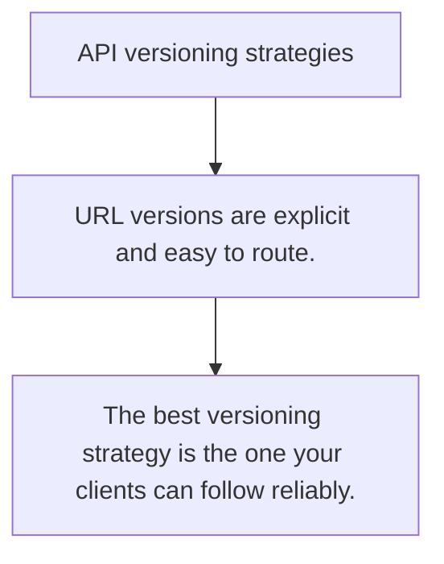

# API.2 API versioning strategies

## Mission

Learn the trade-offs between URL versioning, header versioning, and evolutionary compatibility.

## Prerequisites

- API.1

## Mental Model

Versioning is a change-management tool. The goal is controlled evolution, not version numbers everywhere.

## Visual Model



## Machine View

Clients need stable contracts while servers need room to change. Version strategy is the negotiation point between those needs.

## Run Instructions

```bash
go run ./06-backend-db/01-web-and-database/apis/2-api-versioning-strategies
```

## Code Walkthrough

### URL versions are explicit and easy to route.

URL versions are explicit and easy to route.

### Header versions keep URLs stable but are easier to mis

Header versions keep URLs stable but are easier to miss.

### The best versioning strategy is the one your clients c

The best versioning strategy is the one your clients can follow reliably.

## Try It

1. Change one of the example inputs and rerun the lesson.
2. Explain which boundary the lesson is trying to make explicit.
3. Describe how you would apply API.2 in a small service or tool.

## ⚠️ In Production

Versioning policy should be boring, documented, and easy for clients to discover.

## 🤔 Thinking Questions

1. What problem does this topic solve?
2. What breaks if this boundary is handled implicitly instead of explicitly?
3. Where would you expect to use this topic in production Go code?

## Next Step

Continue to `API.3`.
