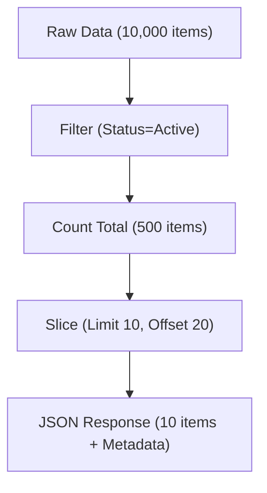

# API.3 Pagination and filtering

## Mission

Learn how to handle large datasets by implementing efficient pagination and flexible filtering, ensuring your API remains fast and responsive regardless of how much data you have.

## Prerequisites

- `API.2` api-versioning-strategies

## Mental Model

Think of pagination and filtering as **Using a Search Engine**.

1. **The Query (Filtering)**: You don't want to see "everything in the world"; you only want "Books about Go" (`?category=books`).
2. **The Results Page (Limit)**: Even if there are 1,000,000 results, the engine only shows you 10 at a time so the page loads quickly.
3. **The Navigation (Offset)**: If the first 10 aren't what you want, you click "Next" to see the next 10 items.
4. **The Summary (Metadata)**: The engine tells you: "Showing 11-20 of 1,450 results."

## Visual Model



## Machine View

At the database level, pagination is usually handled via `LIMIT` and `OFFSET` clauses.
- `SELECT * FROM users WHERE status='active' LIMIT 10 OFFSET 20`
While simple, **Offset-based pagination** has a performance trap: the database must still read and discard the first 20 rows before returning the next 10. As the offset reaches the millions, this becomes very slow. **Cursor-based pagination** solves this by asking for "items after ID 1234," which allows the database to jump directly to the right spot using an index. For filtering, each query parameter should ideally correspond to an indexed column in your database to prevent slow "Full Table Scans."

## Run Instructions

```bash
go run ./06-backend-db/01-web-and-database/apis/3-pagination-and-filtering
```

Test the pagination and filtering using `curl`:
```bash
# Get 5 items starting from index 10
curl "http://localhost:8090/products?limit=5&offset=10"

# Filter by category
curl "http://localhost:8090/products?category=Books"
```

## Code Walkthrough

### `strconv.Atoi`
Query parameters always arrive as strings. We must convert them to integers to perform slicing or math. Always handle the error or set a safe default!

### Slicing Logic
Go's slice syntax `list[start:end]` is perfect for pagination. We must be careful with boundary checks (e.g., ensuring `end` doesn't exceed the list length) to avoid a runtime panic.

### Response Metadata
It is essential to tell the client the **Total Count** of filtered items, not just the count of the current page. This allows the client to calculate how many pages exist in total.

### Security: Max Limit
Always enforce a maximum `limit` (e.g., 50 or 100). If you allow `limit=1000000`, a malicious user can intentionally crash your server by forcing it to allocate massive amounts of memory.

## Try It

1. Implement "Sort" functionality by adding a `?sort=name` query parameter.
2. Add a `search` parameter that performs a partial string match on the product title.
3. Try to break the server by sending a negative `offset` or a non-numeric `limit`. Fix the code to handle these cases.

## In Production
For production APIs, consider using a **Standardized URL Structure** for pagination, such as:
- `/products?page=1&per_page=20` (User-friendly)
- `/products?limit=20&offset=0` (Database-friendly)
- `/products?cursor=abc123` (Performance-friendly)
Choose one and stick to it across your entire API!

## Thinking Questions
1. Why is offset-based pagination slow for very large offsets?
2. How would you handle filtering by multiple categories at once? (`?category=books&category=tools`)
3. What is the benefit of returning the `limit` and `offset` back to the client in the response body?

> **Forward Reference:** You have mastered RESTful API design. But what if you need something faster, more efficient, and type-safe? In [Lesson 4: Protobuf Basics](../4-protobuf-basics/README.md), you will learn about the binary format that powers gRPC and high-performance microservices.

## Next Step

Continue to `API.4` protobuf-basics.
