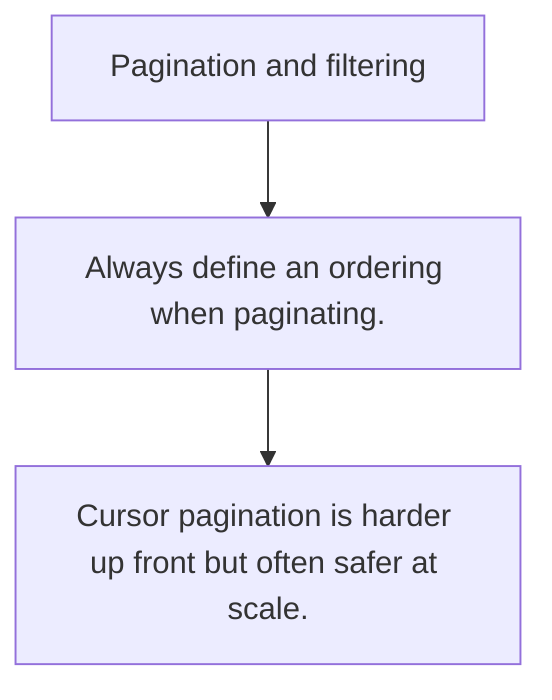

# API.3 Pagination and filtering

## Mission

Learn why large result sets need stable pagination and explicit filtering rules.

## Prerequisites

- API.2

## Mental Model

Pagination is resource budgeting. It prevents one query from turning one endpoint into unbounded work.

## Visual Model



## Machine View

The server has to manage ordering, cursors or offsets, and filter rules so repeated calls stay predictable.

## Run Instructions

```bash
go run ./06-backend-db/01-web-and-database/apis/3-pagination-and-filtering
```

## Code Walkthrough

### Always define an ordering when paginating.

Always define an ordering when paginating.

### Offset pagination is simple but weak on large, changin

Offset pagination is simple but weak on large, changing datasets.

### Cursor pagination is harder up front but often safer a

Cursor pagination is harder up front but often safer at scale.

## Try It

1. Change one of the example inputs and rerun the lesson.
2. Explain which boundary the lesson is trying to make explicit.
3. Describe how you would apply API.3 in a small service or tool.

## ⚠️ In Production

Pagination bugs often become latency bugs, memory bugs, or duplicated work for clients.

## 🤔 Thinking Questions

1. What problem does this topic solve?
2. What breaks if this boundary is handled implicitly instead of explicitly?
3. Where would you expect to use this topic in production Go code?

## Next Step

Continue to `API.4`.
