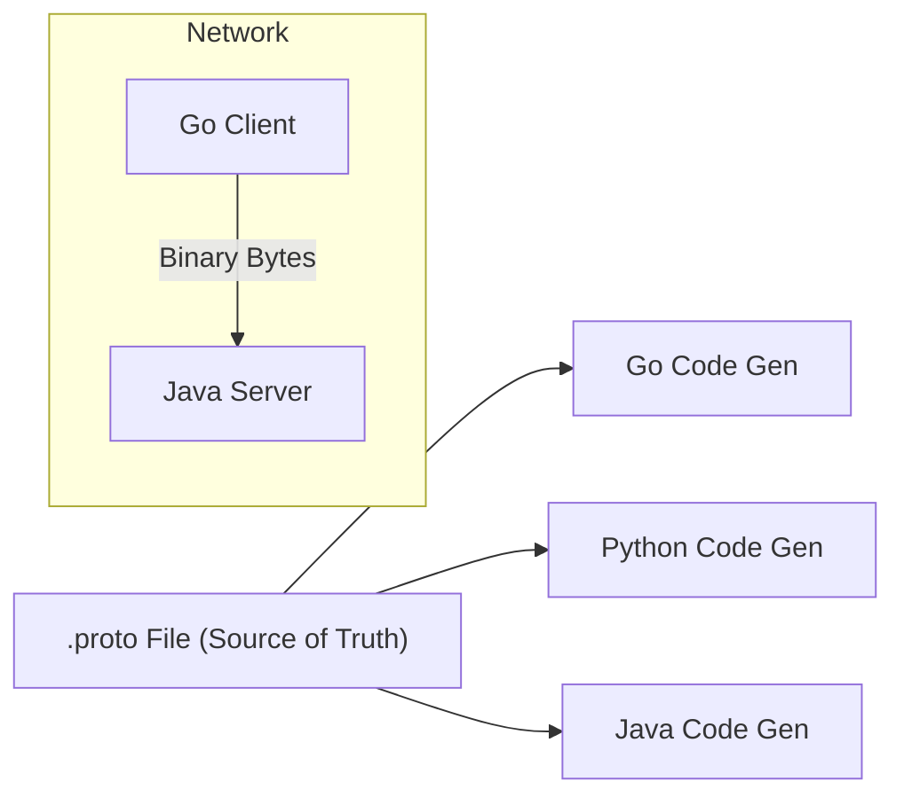

# API.4 Protobuf basics

## Mission

Understand the power of Protocol Buffers (Protobuf) as a schema-first, high-performance serialization format and learn why it is the foundation of modern microservice architectures.

## Prerequisites

- `API.3` pagination-and-filtering

## Mental Model

Think of Protobuf as **Blueprints vs. Scribbled Notes**.

1. **JSON (Scribbled Notes)**: You hand someone a napkin that says "id: 1, name: rasel". They have to read the whole thing, figure out the handwriting, and hope you didn't forget a comma. If the note is long, it takes a long time to read.
2. **Protobuf (Blueprints)**: You and your friend both have the same printed blueprint. When you want to send data, you just send a series of tiny magnetic pulses that correspond to the slots in the blueprint. Your friend looks at their copy of the blueprint and instantly knows exactly what goes where. It's incredibly fast, takes up very little space, and there's no room for misunderstanding.

## Visual Model



## Machine View

Protobuf is a binary format. Unlike JSON, which is human-readable and text-based, Protobuf is optimized for computers.
- **Payload Size**: JSON repeats field names (`"first_name"`) for every record. Protobuf replaces them with 1-byte tags. This typically results in payloads 3x to 10x smaller than JSON.
- **Parsing Speed**: Parsing JSON requires complex string manipulation and character escape handling. Protobuf parsing is a simple memory-offset operation, which is much easier on the CPU and battery (critical for mobile apps).
- **Code Generation**: You define your data in a `.proto` file and use the `protoc` compiler to generate native code for your chosen language. This provides full type-safety and autocompletion in your IDE.

## Run Instructions

```bash
go run ./06-backend-db/01-web-and-database/apis/4-protobuf-basics
```

This lesson explores the `user.proto` file in this directory. Review the syntax and the field numbering.

## Code Walkthrough

### `syntax = "proto3";`
Always use proto3, the modern version of the language that simplifies many rules and removes the confusing "required" vs "optional" distinction.

### Messages and Fields
A `message` is like a `struct` in Go. Every field has a **Type**, a **Name**, and a **Unique Tag Number**.

### The Importance of Tag Numbers
`int32 id = 1;`
The number `1` is the "Identity" of the field in the binary stream. Once you deploy an API, you **cannot change these numbers**. If you change `id` to tag `2`, old clients will be unable to read the data correctly.

### Repeated Fields
The `repeated` keyword is how Protobuf defines an array or slice.

### Enums
Enums provide a way to define a set of named constants. The first value in an enum **must** be zero and is the default value.

## Try It

1. Add a new field `repeated string tags = 6;` to the `User` message in `user.proto`.
2. Create a `nested` message (e.g., an `Address` message inside the `User` message).
3. Think about how you would handle an optional field that is only sent sometimes.

## In Production
While Protobuf is great for internal microservices, it is harder to use for public web APIs because browsers cannot natively parse binary Protobuf without extra libraries. Most companies use **REST/JSON** for their public-facing web clients and **gRPC/Protobuf** for their internal high-traffic backend communication.

## Thinking Questions
1. Why are field tags more efficient than field names for network transport?
2. What happens if you delete a field tag and then reuse that same number for a different field later?
3. How does Protobuf help prevent bugs in large teams with many different microservices?

> **Forward Reference:** You have the data format. Now you need a transport protocol to move that data between servers. In [Lesson 5: gRPC Fundamentals](../5-grpc-fundamentals/README.md), you will learn how to use Protobuf to build high-performance Remote Procedure Calls.

## Next Step

Next: `API.5` -> `06-backend-db/01-web-and-database/apis/5-grpc-fundamentals`

Open `06-backend-db/01-web-and-database/apis/5-grpc-fundamentals/README.md` to continue.
