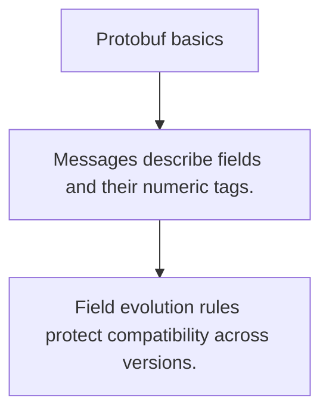

# API.4 Protobuf basics

## Mission

Learn why schema-first messages exist and how protobuf defines transport contracts before code exists.

## Prerequisites

- API.3

## Mental Model

A protobuf schema is a shared contract that many languages can generate code from.

## Visual Model



## Machine View

Field numbers, message shapes, and backward-compatible evolution rules matter more than the syntax itself.

## Run Instructions

```bash
go run ./06-backend-db/01-web-and-database/apis/4-protobuf-basics
```

## Code Walkthrough

### Messages describe fields and their numeric tags.

Messages describe fields and their numeric tags.

### Code generation turns one schema into many language bi

Code generation turns one schema into many language bindings.

### Field evolution rules protect compatibility across ver

Field evolution rules protect compatibility across versions.

## Try It

1. Change one of the example inputs and rerun the lesson.
2. Explain which boundary the lesson is trying to make explicit.
3. Describe how you would apply API.4 in a small service or tool.

## ⚠️ In Production

Schema mistakes are distributed mistakes because every generated client and server inherits them.

## 🤔 Thinking Questions

1. What problem does this topic solve?
2. What breaks if this boundary is handled implicitly instead of explicitly?
3. Where would you expect to use this topic in production Go code?

## Next Step

Continue to `API.5`.
