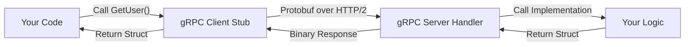

# API.5 gRPC fundamentals

## Mission

Master the basics of gRPC (Google Remote Procedure Call), understand how it differs from REST, and learn how to define services that communicate over high-performance HTTP/2.

## Prerequisites

- `API.4` protobuf-basics

## Mental Model

Think of gRPC as **Calling a Friend on a Dedicated Intercom**.

1. **REST (Sending a Letter)**: You write a letter (JSON), put it in an envelope (HTTP), address it to a building (the Resource), and wait for the mailman to bring a reply.
2. **gRPC (The Intercom)**: You have a button on your desk that says "Call Rasel". When you press it, you are instantly connected. You don't care about envelopes or stamps; you just speak into the microphone (call the function) and hear the answer immediately. The intercom system (the gRPC runtime) handles all the wiring and packaging for you.

## Visual Model



## Machine View

gRPC is built on three pillars:
1. **Protobuf**: For serialization (Lesson 4).
2. **HTTP/2**: For transport. It supports bidirectional streaming and header compression (HPACK).
3. **IDL (Interface Definition Language)**: The `.proto` file acts as the contract.
Unlike REST, which uses text-based status codes and headers, gRPC uses a specific set of 16 status codes (e.g., `OK`, `NOT_FOUND`, `UNAUTHENTICATED`) and a binary framing layer. This allows for significantly higher throughput and lower latency, especially in internal networks where speed is paramount.

## Run Instructions

```bash
go run ./06-backend-db/01-web-and-database/apis/5-grpc-fundamentals
```

Review the `service.proto` file in this directory to see how service methods and messages are defined together.

## Code Walkthrough

### The `service` Block
This is where you define the API surface. Each `rpc` line defines a method that can be called by a client.

### Unary RPC
`rpc GetUser(Request) returns (Response);`
This is the "classic" request-response pattern. The client sends one request and waits for exactly one response.

### The gRPC Ecosystem
To use gRPC in Go, you use the `protoc-gen-go` and `protoc-gen-go-grpc` plugins. These generate:
1. **The Client Stub**: A struct you can use to call the server.
2. **The Server Interface**: An interface you must implement to handle incoming calls.

### Deadlines and Metadata
gRPC includes built-in support for **Deadlines** (timeouts) and **Metadata** (equivalent to HTTP headers, but used for auth tokens and request IDs).

## Try It

1. Add a new `rpc` method called `UpdateUser` to the `UserService`.
2. Define a `DeleteUserRequest` message that contains only an `id`.
3. Think about how you would handle an error in gRPC-what status code would you return if a user was not found?

## In Production
gRPC is incredible for **Service-to-Service** communication (Microservices). However, it requires an HTTP/2 compatible load balancer (like NGINX or Envoy) to work correctly. Traditional L4 load balancers might not properly distribute traffic because gRPC keeps long-lived TCP connections open.

## Thinking Questions
1. Why is gRPC faster than REST/JSON?
2. What are the downsides of having a strictly defined contract between services?
3. How does gRPC handle cases where the client and server are written in different languages?

> **Forward Reference:** Unary calls are great, but gRPC's real "superpower" is its ability to stream data. In [Lesson 6: gRPC Streaming](../6-grpc-streaming/README.md), you will learn how to build real-time APIs that can send thousands of messages over a single connection.

## Next Step

Next: `API.6` -> `06-backend-db/01-web-and-database/apis/6-grpc-streaming`

Open `06-backend-db/01-web-and-database/apis/6-grpc-streaming/README.md` to continue.
