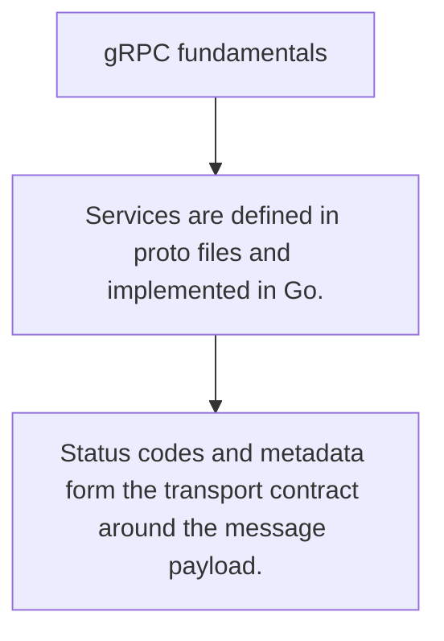

# API.5 gRPC fundamentals

## Mission

Learn the core request/response model behind gRPC services and generated contracts.

## Prerequisites

- API.4

## Mental Model

gRPC is RPC over a strong schema contract rather than ad-hoc JSON payloads.

## Visual Model



## Machine View

Generated client and server stubs remove transport boilerplate but leave ownership of service design to you.

## Run Instructions

```bash
go run ./06-backend-db/01-web-and-database/apis/5-grpc-fundamentals
```

## Code Walkthrough

### Services are defined in proto files and implemented in

Services are defined in proto files and implemented in Go.

### Unary RPCs look like strongly typed function calls acr

Unary RPCs look like strongly typed function calls across the network.

### Status codes and metadata form the transport contract 

Status codes and metadata form the transport contract around the message payload.

## Try It

1. Change one of the example inputs and rerun the lesson.
2. Explain which boundary the lesson is trying to make explicit.
3. Describe how you would apply API.5 in a small service or tool.

## ⚠️ In Production

gRPC shines most when typed contracts, internal services, and generated clients are a better fit than public HTTP ergonomics.

## 🤔 Thinking Questions

1. What problem does this topic solve?
2. What breaks if this boundary is handled implicitly instead of explicitly?
3. Where would you expect to use this topic in production Go code?

## Next Step

Continue to `API.6`.
