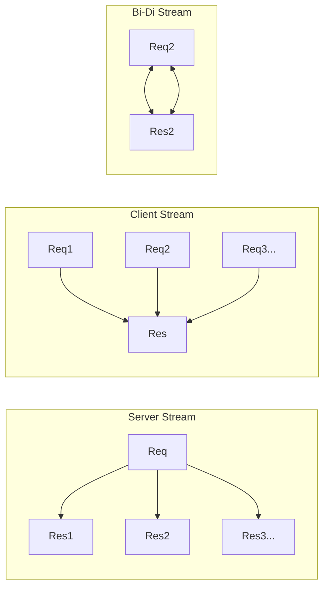

# API.6 gRPC streaming

## Mission

Learn how to implement advanced communication patterns using gRPC streaming, including server-side, client-side, and bidirectional streams for real-time data exchange.

## Prerequisites

- `API.5` grpc-fundamentals

## Mental Model

Think of the different streaming types as **Different Forms of Communication**.

1. **Unary (Standard Call)**: You ask a question, your friend answers. (Request-Response).
2. **Server Streaming (The Lecture)**: You ask "Tell me about Go", and your friend talks for 20 minutes (One Request, many Messages).
3. **Client Streaming (The Grocery List)**: You name off items one by one ("Apples", "Milk", "Bread"), and when you're done, your friend says "Got it, 3 items". (Many Messages, one Response).
4. **Bidirectional Streaming (The Phone Call)**: You and your friend both talk whenever you have something to say. (Many Messages <-> Many Messages).

## Visual Model



## Machine View

gRPC streaming is made possible by **HTTP/2 Streams**.
In HTTP/1.1, a "stream" didn't really exist; you just held the connection open. In HTTP/2, multiple independent "streams" can exist on a single TCP connection. This means you can have a bidirectional gRPC chat happening at the same time as a large file upload, and neither will block the other.
- **Backpressure**: gRPC uses HTTP/2 flow control to ensure that a fast sender doesn't overwhelm a slow receiver.
- **Cancellation**: If a client closes their side of a stream, the server is notified immediately via the `context.Context`, allowing it to stop doing unnecessary work.

## Run Instructions

```bash
go run ./06-backend-db/01-web-and-database/apis/6-grpc-streaming
```

Review the `streaming.proto` file to see how the `stream` keyword is used in method signatures.

## Code Walkthrough

### `rpc GetNotifications(Request) returns (stream Notification)`
The `stream` keyword on the return type indicates that the server will return an object that the client can iterate over. In Go, this is generated as a `Recv()` method on the client and a `Send()` method on the server.

### `rpc UploadSensorData(stream SensorData) returns (Response)`
The `stream` keyword on the parameter indicates that the client will send multiple messages. The server will receive these in a loop until the client signals it is finished.

### `rpc RealTimeChat(stream Message) returns (stream Message)`
The ultimate form of communication. Both sides have a `Send()` and `Recv()` loop running concurrently (often in different goroutines).

## Try It

1. Design a gRPC service for a "GPS Tracking" app. Should the server stream the locations to the client, or should the client stream the locations to the server?
2. Add a `stream` return to the `GetUser` method from Lesson 5. What does that imply about the user data?
3. Think about how you would handle a network disconnect in the middle of a 1-hour bidirectional stream.

## In Production
Streaming is powerful but **Expensive**. Each active stream keeps a TCP connection open and a goroutine active on the server. If you have 10,000 users all holding open "Notification Streams," you need a plan for scaling and resource management. Always implement **Timeouts** and **Keep-Alives** to clean up "Zombie Streams" from dead clients.

## Thinking Questions
1. Why is gRPC streaming better than WebSocket for service-to-service communication?
2. How would you implement a "Heartbeat" inside a bidirectional stream?
3. When should you use a stream instead of a simple array in a Unary response? (Hint: Think about memory usage).

> **Forward Reference:** Now that you can send data in every possible way, how do you handle security, logging, and metrics for all these calls? In [Lesson 7: gRPC Interceptors](../7-grpc-interceptors/README.md), you will learn how to wrap gRPC calls with middleware logic.

## Next Step

Next: `API.7` -> `06-backend-db/01-web-and-database/apis/7-grpc-interceptors`

Open `06-backend-db/01-web-and-database/apis/7-grpc-interceptors/README.md` to continue.
