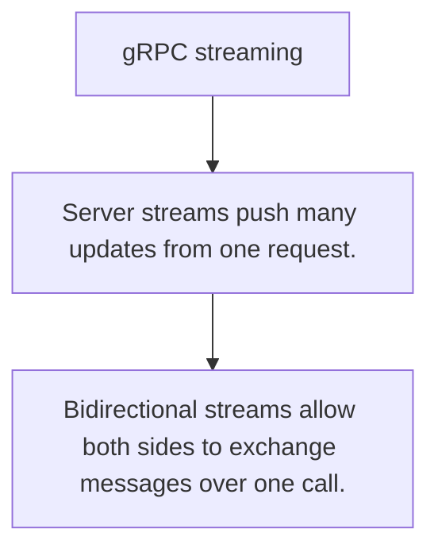

# API.6 gRPC streaming

## Mission

Learn how server, client, and bidirectional streams change the contract from one message to many.

## Prerequisites

- API.5

## Mental Model

Streaming turns one call into a long-lived message flow rather than a single request/response pair.

## Visual Model



## Machine View

HTTP/2 streams let one connection carry many ordered message exchanges with flow control.

## Run Instructions

```bash
go run ./06-backend-db/01-web-and-database/apis/6-grpc-streaming
```

## Code Walkthrough

### Server streams push many updates from one request.

Server streams push many updates from one request.

### Client streams batch or trickle many inputs into one r

Client streams batch or trickle many inputs into one response.

### Bidirectional streams allow both sides to exchange mes

Bidirectional streams allow both sides to exchange messages over one call.

## Try It

1. Change one of the example inputs and rerun the lesson.
2. Explain which boundary the lesson is trying to make explicit.
3. Describe how you would apply API.6 in a small service or tool.

## ⚠️ In Production

Streaming is powerful but should be chosen for ongoing flows, not just because it looks more advanced.

## 🤔 Thinking Questions

1. What problem does this topic solve?
2. What breaks if this boundary is handled implicitly instead of explicitly?
3. Where would you expect to use this topic in production Go code?

## Next Step

Continue to `API.7`.
