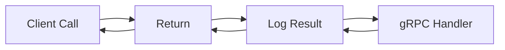

# API.7 gRPC interceptors

## Mission

Learn how to implement Interceptors in gRPC to build a powerful middleware layer that handles logging, authentication, and monitoring for all your remote calls in a centralized way.

## Prerequisites

- `API.6` grpc-streaming

## Mental Model

Think of gRPC Interceptors as **Security Guards at a Private Club**.

1. **The Guest (Request)**: The client wants to enter the club and talk to the DJ (The Handler).
2. **The Front Gate (Unary Interceptor)**: The guard checks the guest's ID (Auth), records their arrival time (Logging), and makes sure they aren't bringing in anything dangerous (Validation).
3. **The Persistent Connection (Stream Interceptor)**: For guests who are staying all night (Streaming), the guard checks them in once at the door and then lets them speak to the DJ directly, but still keeps an eye on the overall connection.

## Visual Model



## Machine View

Interceptors are functions that wrap the execution of gRPC methods.
- **Unary Interceptors** are simpler: they take a request, call the handler, and return a response.
- **Stream Interceptors** are more complex: they wrap the creation of the stream. To intercept individual messages within a stream, you must wrap the `ServerStream` or `ClientStream` object itself.
In Go, gRPC server options only allow for **one** unary and **one** stream interceptor by default. If you want a chain of interceptors (Logging -> Auth -> Metrics), you must use a helper library like `go-grpc-middleware` or write a recursive wrapper function.

## Run Instructions

```bash
go run ./06-backend-db/01-web-and-database/apis/7-grpc-interceptors
```

This is a conceptual lesson. Review the code comments to understand the signature and registration flow of interceptors.

## Code Walkthrough

### `grpc.UnaryServerInterceptor`
A function type with the signature:
`func(ctx context.Context, req interface{}, info *UnaryServerInfo, handler UnaryHandler) (resp interface{}, err error)`
- `info.FullMethod`: The path of the RPC being called.
- `handler`: The next step in the chain (either another interceptor or the final logic).

### `grpc.StreamServerInterceptor`
Used for streaming RPCs. It intercepts the **handshake** of the stream. If you need to log every message sent on a stream, you must create a wrapper struct for the `grpc.ServerStream` and override the `SendMsg` and `RecvMsg` methods.

### Metadata
Interceptors often use `metadata.FromIncomingContext(ctx)` to read headers sent by the client. This is where you would look for an `Authorization` bearer token.

## Try It

1. Write the pseudo-code for an interceptor that recovers from panics and returns a `Codes.Internal` gRPC error.
2. How would you pass a `RequestID` from an interceptor to the inner handler using `context.WithValue`?
3. Look at the `grpc-ecosystem/go-grpc-middleware` repository on GitHub to see standard interceptors for recovery, logging, and auth.

## In Production
**Performance is critical.** Interceptors run on every single request. If your Auth interceptor takes 100ms to check a database, you have just added 100ms of latency to every single call in your entire system. Use caching for auth tokens and keep your interceptors as "O(1)" as possible.

## Thinking Questions
1. Why does gRPC use the term "Interceptor" instead of "Middleware"?
2. What is the difference between an interceptor on the Client vs. the Server?
3. How would you implement rate limiting using an interceptor?

> **Forward Reference:** You've mastered both REST and gRPC. Which one should you use for your next project? In [Lesson 8: REST vs gRPC - The Trade-off](../8-rest-vs-grpc/README.md), we will compare these two giants head-to-head.

## Next Step

Continue to `API.8` rest-vs-grpc.
