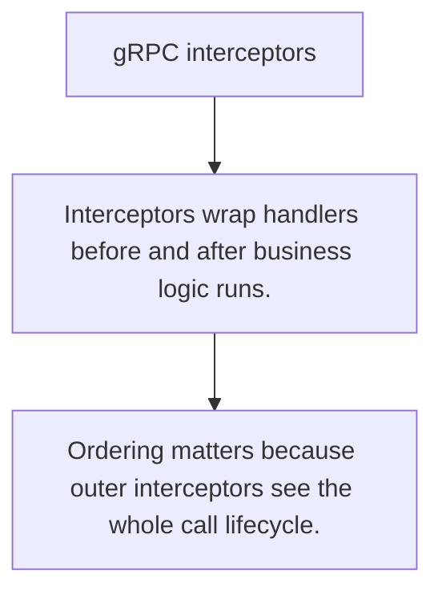

# API.7 gRPC interceptors

## Mission

Learn how interceptors provide middleware-style hooks for auth, logging, metrics, and recovery in gRPC.

## Prerequisites

- API.6

## Mental Model

Interceptors are the gRPC equivalent of HTTP middleware around an RPC handler.

## Visual Model



## Machine View

Unary and stream interceptors sit at the transport boundary where cross-cutting concerns belong.

## Run Instructions

```bash
go run ./06-backend-db/01-web-and-database/apis/7-grpc-interceptors
```

## Code Walkthrough

### Interceptors wrap handlers before and after business l

Interceptors wrap handlers before and after business logic runs.

### Recovery, auth, and logging are common boundary concer

Recovery, auth, and logging are common boundary concerns.

### Ordering matters because outer interceptors see the wh

Ordering matters because outer interceptors see the whole call lifecycle.

## Try It

1. Change one of the example inputs and rerun the lesson.
2. Explain which boundary the lesson is trying to make explicit.
3. Describe how you would apply API.7 in a small service or tool.

## ⚠️ In Production

Transport policy should live in interceptors or shared boundary helpers, not be copy-pasted into every RPC method.

## 🤔 Thinking Questions

1. What problem does this topic solve?
2. What breaks if this boundary is handled implicitly instead of explicitly?
3. Where would you expect to use this topic in production Go code?

## Next Step

Continue to `API.8`.
