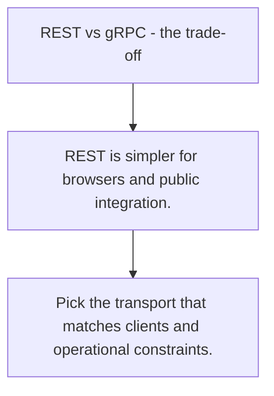

# API.8 REST vs gRPC - the trade-off

## Mission

Compare when REST is a better fit and when gRPC earns its extra contract machinery.

## Prerequisites

- API.7

## Mental Model

No transport is universally best. The right choice depends on clients, tooling, latency, and discoverability requirements.

## Visual Model



## Machine View

Transport choice changes payload encoding, client generation, debugging ergonomics, and where compatibility pressure lands.

## Run Instructions

```bash
go run ./06-backend-db/01-web-and-database/apis/8-rest-vs-grpc
```

## Code Walkthrough

### REST is simpler for browsers and public integration.

REST is simpler for browsers and public integration.

### gRPC is strong for typed internal service-to-service c

gRPC is strong for typed internal service-to-service communication.

### Pick the transport that matches clients and operationa

Pick the transport that matches clients and operational constraints.

## Try It

1. Change one of the example inputs and rerun the lesson.
2. Explain which boundary the lesson is trying to make explicit.
3. Describe how you would apply API.8 in a small service or tool.

## ⚠️ In Production

Teams waste time when they choose gRPC for public human-facing APIs or JSON over HTTP for every high-volume internal service without thinking.

## 🤔 Thinking Questions

1. What problem does this topic solve?
2. What breaks if this boundary is handled implicitly instead of explicitly?
3. Where would you expect to use this topic in production Go code?

## Next Step

Continue to `API.9`.
