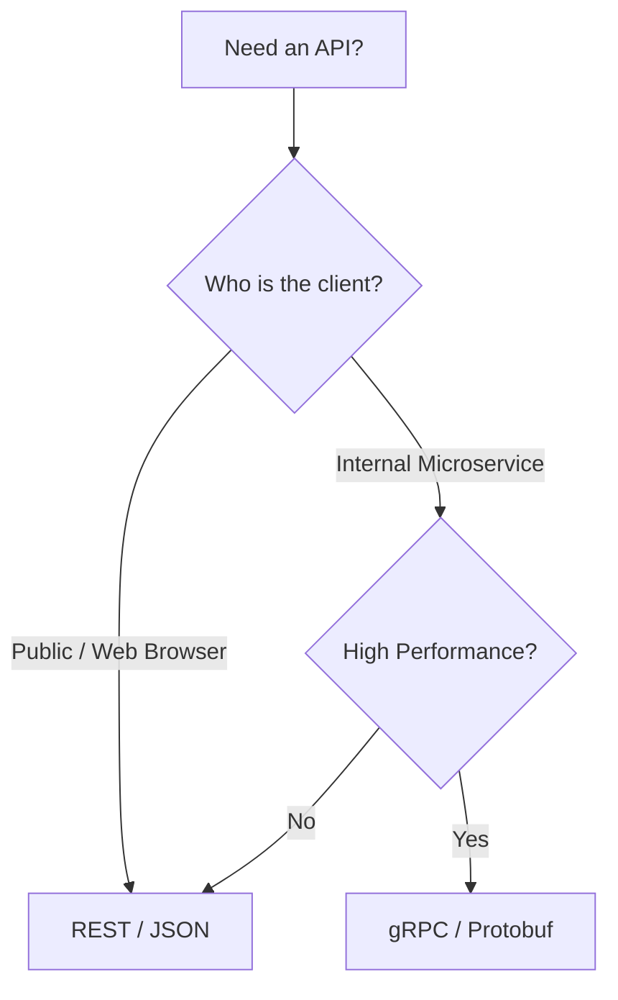

# API.8 REST vs gRPC - the trade-off

## Mission

Examine the technical and architectural trade-offs between REST/JSON and gRPC/Protobuf, and learn how to make an informed decision on which transport to use for a given project.

## Prerequisites

- `API.7` grpc-interceptors

## Mental Model

Think of the choice between REST and gRPC as **Choosing a Vehicle**.

1. **REST (The Family Sedan)**: It's comfortable, everyone knows how to drive it, and it can go almost anywhere (any browser, any language). It's not the fastest car on the track, but it's the most versatile.
2. **gRPC (The Formula 1 Race Car)**: It's incredibly fast, custom-built for performance, and uses advanced tech (HTTP/2, Binary framing). However, you need a specialized driver and a specific track (Protobuf compiler, HTTP/2 infrastructure) to use it. You wouldn't use an F1 car to go to the grocery store (build a public web API).

## Visual Model



## Machine View

The machine view is a battle of **Serialization** and **Protocol**.
- **Serialization**: JSON is text. The CPU must scan every character, handle quotes, and escape sequences. Protobuf is a stream of bytes with fixed-length headers. It is fundamentally faster to process.
- **Protocol**: HTTP/1.1 is "Half-Duplex" (Wait for a response before sending the next request). HTTP/2 is "Full-Duplex" (Send many things at once). gRPC requires HTTP/2, while REST can run on either.
- **Contract**: gRPC is "Design-First." You cannot write a line of code without a `.proto` file. REST is often "Code-First," which can lead to undocumented "drift" in the API over time.

## Run Instructions

```bash
go run ./06-backend-db/01-web-and-database/apis/8-rest-vs-grpc
```

This is a summary lesson. Review the decision matrix in the console output.

## Code Walkthrough

### Decision Matrix
The code demonstrates a direct comparison of the two technologies. Notice how we use a structured format to output the differences.

### Comparison Points

### Debugging
- **REST**: Open your browser dev tools or use `curl`. The data is human-readable.
- **gRPC**: You need a special tool like `grpcurl` or `Postman` with the `.proto` file imported to see what's happening.

### Schema
- **REST**: Often documented with OpenAPI/Swagger. It's an "opt-in" discipline.
- **gRPC**: The schema is the code. If you don't have the `.proto`, you don't have an API.

### Speed
- gRPC is typically 5-10x faster than REST for large payloads and high-concurrency environments.

## Try It

1. Research "gRPC-Web"-how does it allow browsers to talk to gRPC services?
2. Find an example of a "Streaming" REST API (like the Twitter/X firehose). Compare it to gRPC streaming.
3. If you had to build a simple "Todo List" for yourself, which one would you choose and why?

## Verification Surface

Run the comparison lesson to see the decision matrix:

```text
=== REST vs gRPC Decision Matrix ===

   FEATURE         REST/JSON           gRPC/Protobuf
   -------         ---------           -------------
   Payload         Text (Large)        Binary (Small)
   Browser         Native Support      Requires Proxy
   Contract        Optional (OpenAPI)  Strict (Protobuf)
   Performance     Medium              Ultra High
   Streaming       Limited             First-class
```

## In Production
Many large organizations (like Google, Netflix, and Uber) use a **Hybrid Approach**:
- **REST** for the "Edge" (External traffic from mobile apps and web).
- **gRPC** for the "Interior" (Service-to-service calls inside the private network).
There are even tools (like `grpc-gateway`) that can automatically generate a REST API from your gRPC service definition!

## Thinking Questions
1. Why is gRPC considered more "Type-Safe" than REST?
2. What happens to a REST client if you change a field from an integer to a string?
3. How does the use of HTTP/2 headers in gRPC help with performance?

> [!TIP]
> You have the knowledge. Now it's time for the proof. In [Lesson 9: gRPC Service Exercise](../9-grpc-service-exercise/README.md), you will build a complete gRPC service that handles both Unary and Streaming calls.

## Next Step

Next: `API.9` -> [`06-backend-db/01-web-and-database/apis/9-grpc-service-exercise`](../9-grpc-service-exercise/README.md)
