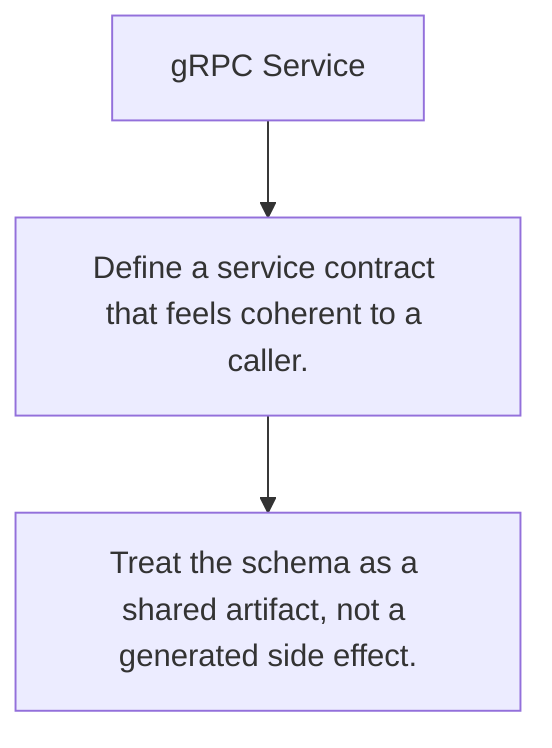

# API.9 gRPC Service

## Mission

Build a small service contract that combines protobuf design, unary calls, and boundary behavior into one exercise.

## Prerequisites

- API.1
- API.2
- API.3
- API.4
- API.5
- API.6
- API.7
- API.8

## Mental Model

An RPC service is just a contract plus a disciplined implementation of that contract.

## Visual Model



## Machine View

The exercise matters because it forces you to move from transport vocabulary into a service shape that could actually evolve.

## Run Instructions

```bash
go run ./06-backend-db/01-web-and-database/apis/9-grpc-service-exercise
```

## Solution Walkthrough

- Define a service contract that feels coherent to a caller.
- Keep transport concerns explicit at the boundary.
- Treat the schema as a shared artifact, not a generated side effect.

## Verification Surface

- Use `go run ./06-backend-db/01-web-and-database/apis/9-grpc-service-exercise`.
- Starter path: `06-backend-db/01-web-and-database/apis/9-grpc-service-exercise/_starter`.

## Try It

1. Change one of the example inputs and rerun the lesson.
2. Explain which boundary the lesson is trying to make explicit.
3. Describe how you would apply API.9 in a small service or tool.

## ⚠️ In Production

Exercise work is where schema design stops being abstract and becomes something clients must live with.

## 🤔 Thinking Questions

1. What problem does this topic solve?
2. What breaks if this boundary is handled implicitly instead of explicitly?
3. Where would you expect to use this topic in production Go code?

## Next Step

Use this lesson as a reference surface before moving to the next track in the section.
