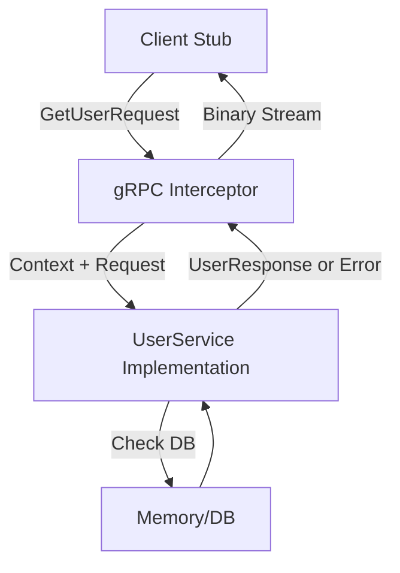

# API.9 gRPC Service

## Mission

Put your Protobuf and gRPC knowledge into practice by implementing a simulated gRPC service. You will learn how to satisfy generated interfaces, handle request context, and manage errors in an RPC-style architecture.

## Prerequisites

- `API.1` through `API.8`

## Mental Model

Think of the gRPC Exercise as **Building a Standardized Vending Machine**.

1. **The Slot (Request)**: A very specific shape (The Protobuf message).
2. **The Mechanism (The Server)**: The internal logic that takes the request, processes it, and dispenses the item.
3. **The Item (Response)**: A very specific shape (The Protobuf response).
4. **The Security (Context)**: If the person walking up to the machine walks away before the item is dispensed (Context Cancelled), the machine stops processing immediately to save energy.

## Visual Model



## Machine View

When you implement a gRPC service in Go, you are implementing an interface generated by `protoc`.
Every method in that interface takes `context.Context` as its first argument.
**Crucial Skill**: You must always check `ctx.Done()` or respect the context deadline. If a client disconnects, your server should stop whatever it's doing (like a long database query) to free up resources. Additionally, gRPC errors should ideally be wrapped using the `status` package (e.g., `status.Error(codes.NotFound, "user missing")`) so the client receives a machine-readable status code rather than a generic string.

## Run Instructions

```bash
go run ./06-backend-db/01-web-and-database/apis/9-grpc-service-exercise
```

The exercise simulates the behavior of a gRPC server implementation using native Go code.

## Solution Walkthrough

### Interface Satisfaction
The `userService` struct satisfies the `UserServiceServer` interface. This is the core pattern of gRPC in Go: the transport is generated for you, but the business logic is your responsibility.

### Context Awareness
Notice the use of `select { case <-ctx.Done(): ... }`. This is how you prevent "Goroutine Leaks" in high-traffic services. If the client gives up, the server should give up too.

### Error Handling
In this exercise, we return a simple `fmt.Errorf`. In a real gRPC service, we would use the `google.golang.org/grpc/status` package to return codes like `codes.InvalidArgument` or `codes.Internal`.

### Decoupling
The service implementation doesn't know anything about HTTP/2, binary framing, or serialization. It only knows about Go structs and contexts. This clean separation is why gRPC is so popular for backend development.

## Try It

1. Implement a `CreateUser` method that adds a new user to the map.
2. Add a `stream` method that returns all users in the map one by one.
3. Modify the `GetUser` method to return a specific gRPC error code using the `status` package (if you have the library installed).

## Verification Surface

The exercise simulates a gRPC server. You should see the successful retrieval of a user:

```text
=== API.9 gRPC Service ===

  [RPC] Calling GetUser(ID=1)...
  [SUCCESS]: Found User alice@example.com

  [RPC] Calling GetUser(ID=99)...
  [ERROR]: user not found (ID: 99)
```

## In Production
For production gRPC services, you should always:
- Use **Interceptors** for logging and auth (Lesson 7).
- Set strict **Deadlines** on the client side.
- Use a **Load Balancer** that understands gRPC (L7) to ensure traffic is distributed evenly across your backend instances.

## Thinking Questions
1. Why is the `context.Context` the most important argument in a gRPC method?
2. What are the benefits of having the server interface generated for you?
3. How would you handle a "Breaking Change" in this service implementation?

> **Forward Reference:** You have mastered the "Web" side of Backend Engineering. Now, it's time to learn about the "Database" side. In [Section 06: Databases / Lesson 1: Connecting to SQLite](../../databases/1-connecting-to-db/README.md), you will begin your journey into persistent data storage.

## Next Step

Next: `DB.1` -> `06-backend-db/01-web-and-database/databases/1-connecting-to-db`

Open `06-backend-db/01-web-and-database/databases/1-connecting-to-db/README.md` to continue.
