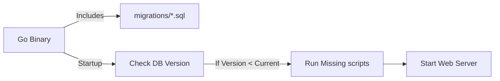

# DM.1 Embedded Migrations

## Mission

Learn how to manage database schema evolution professionally by using migration files and embedding them directly into your Go binary, ensuring that your database always matches your code.

## Prerequisites

- `DB.8` query-timeouts-via-context

## Mental Model

Think of Migrations as **Version Control for your Database**.

1. **The Problem**: You added a `phone_number` field to your code. Now, everyone on your team and every server in production needs to manually run `ALTER TABLE users ADD COLUMN...`. If someone forgets, the app crashes.
2. **The Solution (The Script)**: You write a small SQL script called `001_add_phone.up.sql`.
3. **The Automation (The Engine)**: When your app starts, it checks a special table in the database called `schema_migrations`. If it sees that version `001` hasn't been run yet, it runs the script for you.
4. **The Deployment (Embed)**: By embedding the scripts into your binary, you don't have to worry about "finding" the SQL files on the server. The instructions are inside the app.

## Visual Model



## Machine View

The `//go:embed` directive is a powerful Go feature that reads files at compile-time and stores them as a byte slice inside the binary.
- **Atomic Schema Changes**: By using `golang-migrate`, each migration is treated as a single step. If a script fails halfway through, the database remains at the previous version (depending on the database's support for DDL transactions).
- **History Table**: The library maintains a `schema_migrations` table with a single row containing the current version number.
- **Consistency**: This ensures that every developer on your team and every environment (Dev, Staging, Prod) is running the exact same database structure.

## Run Instructions

```bash
go run ./06-backend-db/01-web-and-database/database-migrations/1-embedded-migrations
```

This example demonstrates the code structure needed to run migrations against a PostgreSQL database. It will likely fail with a connection error since no database is running, which is expected.

## Code Walkthrough

### `//go:embed migrations/*.sql`
This tells the Go compiler to find the `migrations` folder and include all `.sql` files within it into the `migrationFiles` variable.

### `iofs.New(migrationFiles, "migrations")`
The `iofs` package allows the migration engine to read from our embedded filesystem as if it were a regular disk folder.

### `m.Up()`
This is the command that actually executes the migrations. It finds all `.up.sql` files that haven't been run yet and executes them in numerical order.

### `migrate.ErrNoChange`
This is a "Happy Error." It means the database is already at the latest version and no work was needed.

## Try It

1. Look inside the `migrations/` directory. Observe the naming convention: `VERSION_NAME.up.sql` and `VERSION_NAME.down.sql`.
2. Add a new migration file `002_add_status.up.sql` and think about what SQL command would go inside it.
3. Why do we provide a `.down.sql` file? (Hint: What happens if you need to roll back a release?).

## In Production
**NEVER manually edit your database schema in production.** Every single change, no matter how small, must be a migration file in your repository. This ensures that your local environment and production environment are identical, preventing the "it works on my machine" nightmare.

## Thinking Questions
1. Why is it better to embed migrations in the binary instead of reading them from the disk at runtime?
2. What happens if two developers create a migration with the same version number?
3. How would you handle a data migration (moving data from one column to another) vs. a schema migration?

> [!TIP]
> You have mastered the components of a backend service. Now, it's time to see how they all fit together in a real-world application. In [Lesson 1: Web Masterclass](../../web-masterclass/README.md), you will explore a larger codebase that integrates everything you've learned.

## Next Step

Continue to `MC.1` web-masterclass.
