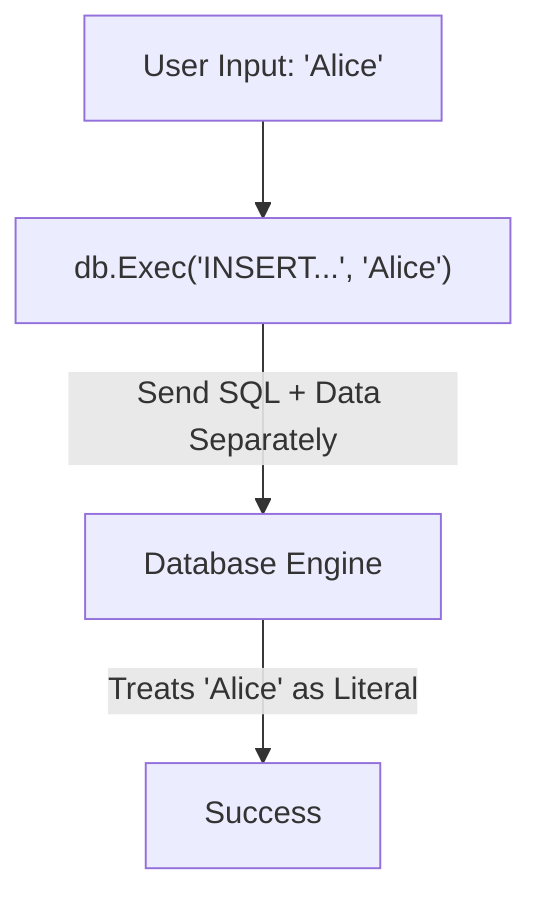

# DB.2 Executing Queries (INSERT)

## Mission

Learn how to safely add data to your database using the `INSERT` command, understand the importance of parameterized queries for security, and retrieve metadata about the operation.

## Prerequisites

- `DB.1` connecting-to-sqlite

## Mental Model

Think of a Parameterized Query as **A Pre-Printed Form**.

1. **The Form (The Query)**: You have a form that says: "Name: \_\_\_\_\_, Email: \_\_\_\_\_".
2. **The Data (The Arguments)**: You write "Rasel" and "rasel@example.com" on separate scraps of paper and hand them to the clerk along with the form.
3. **The Safety**: Because you didn't write the data directly on the form's lines, the clerk knows exactly which part is the "Question" and which part is the "Answer". Even if you wrote "Rasel'); DROP TABLE users;--" on your scrap of paper, the clerk would just treat that as your name, not as a command to delete the building.

## Visual Model



## Machine View

When you use `db.Exec` with placeholders:
- **The SQL**: `INSERT INTO users (name) VALUES (?)`
- **The Data**: `["Alice"]`
Go's database driver sends these as two separate packets to the database. The database "prepares" the SQL first, allocating memory for the result and planning the execution. Then, it "binds" the data to the placeholders. Because the SQL is already parsed, the data cannot change the structure of the query. This is fundamentally different (and safer) than building a string in Go like `fmt.Sprintf("INSERT INTO ... VALUES ('%s')", name)`.

## Run Instructions

```bash
go run ./06-backend-db/01-web-and-database/databases/2-query
```

The output will show the ID of the newly created user.

## Code Walkthrough

### `db.Exec(query, args...)`
The primary method for mutations (INSERT, UPDATE, DELETE). It returns an `sql.Result`.

### Placeholders (`?`)
SQLite uses `?` as a positional placeholder. Other databases might use `$1`, `$2` (PostgreSQL) or `:name` (Oracle). The Go driver handles the translation if necessary.

### `result.LastInsertId()`
Returns the ID generated by the database for an `AUTOINCREMENT` column. Note: Some databases (like PostgreSQL) do not support this via `Exec` and require a `RETURNING` clause instead.

### `result.RowsAffected()`
Returns the number of rows changed by the query. For an `INSERT`, this should always be `1`.

## Try It

1. Try to insert two users with the same email address. What error does the database return?
2. Modify the query to insert a third column `age`.
3. Intentionally use a table name that doesn't exist and observe the error message.

## In Production
**NEVER, EVER use string concatenation for SQL queries.** Even if you think the data is safe (like an ID from your own system), get in the habit of using placeholders for everything. It is the single most important security practice in backend engineering.

## Thinking Questions
1. Why does `result.LastInsertId()` return an `int64` instead of a plain `int`?
2. What happens if you provide more placeholders than arguments?
3. How would you handle a bulk insert of 1,000 rows at once? (Hint: Think about `sql.Tx` which we will cover later).

> **Forward Reference:** You've learned how to insert data. Now let's learn how to retrieve it. In [Lesson 3: SELECTing Data](../3-select/README.md), you will learn how to query rows and scan them into Go structs.

## Next Step

Next: `DB.3` -> `06-backend-db/01-web-and-database/databases/3-select`

Open `06-backend-db/01-web-and-database/databases/3-select/README.md` to continue.
