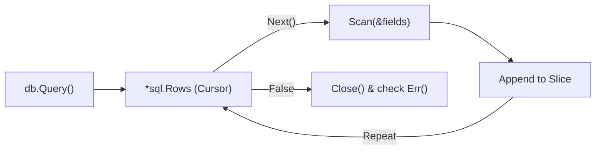

# DB.3 Reading Data (SELECT)

## Mission

Learn how to retrieve data from a database and map it safely into Go structs. You will master the life cycle of a result set, from executing the query to closing the rows.

## Prerequisites

- `DB.2` query-insert

## Mental Model

Think of reading data as **Unloading a Delivery Truck**.

1. **The Order (`db.Query`)**: You tell the warehouse (The Database) exactly what items you want.
2. **The Truck (`*sql.Rows`)**: The warehouse loads the items onto a truck and sends it to your loading dock.
3. **The Unloading (`rows.Next`)**: You take items off the truck one by one.
4. **The Inspector (`rows.Scan`)**: For each item, you check its label and put it into the correct box (your Struct field) in your office.
5. **The Paperwork (`rows.Err`)**: Once the truck is empty, you check the driver's log to make sure no boxes fell out during the trip.
6. **Releasing the Truck (`rows.Close`)**: You signal to the driver that they can leave. If you don't, the truck stays at your dock forever, blocking all other deliveries.

## Visual Model



## Machine View

When you call `db.Query`, the database doesn't send the entire result set at once. Instead, it creates a **Server-Side Cursor** and starts streaming rows as you call `rows.Next()`.
- **Resource Lock**: As long as the `rows` object is open, the underlying network connection is "Reserved." It cannot be returned to the connection pool for other queries to use.
- **Scanning**: The `rows.Scan` function uses reflection to match the database's binary format to Go's internal types (like `string` or `time.Time`).
- **Post-Iteration Errors**: `rows.Err()` is vital because `rows.Next()` might return `false` because of a network failure, not because the data actually ended.

## Run Instructions

```bash
go run ./06-backend-db/01-web-and-database/databases/3-select
```

The example will insert dummy users and then print them back to the console.

## Code Walkthrough

### `db.Query` vs `db.QueryRow`
Use `Query` for 0 or more results. Use `QueryRow` when you expect exactly one (like looking up by ID). `QueryRow` is a shortcut that automatically handles the first `Next()` and `Close()` calls for you.

### `defer rows.Close()`
This is the most important line in database code. It ensures that no matter how your function exits (success, error, or panic), the database connection is released.

### `rows.Scan(&a, &b, ...)`
The arguments to `Scan` must be pointers to the variables where you want the data stored. The order **must** match the columns in your `SELECT` statement exactly.

### `sql.ErrNoRows`
`QueryRow` returns this specific error if no matching record was found. You should almost always check for this explicitly to provide a better user experience (e.g., returning a 404 instead of a 500).

## Try It

1. Change the `SELECT` query to only fetch the `email` column and update the `Scan` call accordingly.
2. Add a `WHERE` clause to filter users by their name.
3. Try to scan a column into the wrong variable type (e.g., a `string` into an `int`) and see the error.

## In Production
For very large result sets (e.g., 1,000,000 rows), do not load them all into a slice in memory. Instead, process each row inside the `rows.Next()` loop and then move on. This keeps your memory usage constant regardless of the result size.

## Thinking Questions
1. Why must the arguments to `rows.Scan` be pointers?
2. What happens to the database connection if you forget to call `rows.Close()`?
3. Why is it necessary to check `rows.Err()` after the loop finishes?

> **Forward Reference:** You're reading and writing data. But repeating the same SQL string over and over is inefficient for the database. In [Lesson 4: Prepared Statements](../4-prepare/README.md), you will learn how to "pre-compile" your SQL to make it faster and safer.

## Next Step

Continue to `DB.4 prepare-statements.
