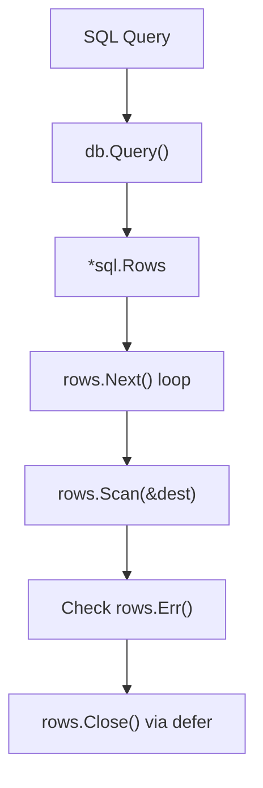

# DB.3 Select Queries

## Mission

Learn how to retrieve data from a database and scan it into Go structs.

## Why This Lesson Exists Now

Writing data is important, but most application logic depends on reading and filtering data. Understanding how to handle result sets (`*sql.Rows`) and single rows is fundamental to backend engineering.

## Prerequisites

- `DB.2` executing queries (INSERT)
- `CF.6` defer use cases

## Mental Model

Think of a `SELECT` query as a "request for a tray of data". The database prepares the tray, and you must "scan" each item from the tray into your own variables before the tray is taken away.

## Visual Model



## Machine View

`rows.Scan` copies data from the database driver's internal buffers into the memory addresses you provide. If the types don't match, `Scan` returns an error. `rows.Next` advances the cursor through the result set.

## Run Instructions

```bash
go run ./06-backend-db/01-web-and-database/databases/3-select
```

## Code Walkthrough

### `db.Query(sql, args...)`

This returns a result set. You must close it when you are done!

### `defer rows.Close()`

> _(This lesson uses `defer rows.Close()`. Defer is taught in CF.5. If you haven't completed CF.5 yet, read `defer` as "run this line when the function returns, regardless of errors.")_

### `rows.Next()` and `rows.Scan()`

This loop iterates through the results. `Scan` takes pointers to the variables where you want the data stored.

## Try It

1. Change the query to filter for a specific ID.
2. Add a new column to the table and update the struct and `Scan` call.
3. Try to scan into a variable of the wrong type (e.g., scanning a string into an int).

## ⚠️ In Production

Always check `rows.Err()` after your loop! A loop might end because of a connection error, not just because there is no more data. If you don't check `rows.Err()`, you might return an incomplete list as if it were complete.

## 🤔 Thinking Questions

1. Why do we pass pointers (`&variable`) to `rows.Scan`?
2. What is the difference between `db.Query` and `db.QueryRow`?
3. Why is `defer rows.Close()` critical even if you iterate through all the rows?

## Next Step

Continue to `DB.4` prepared statements.
