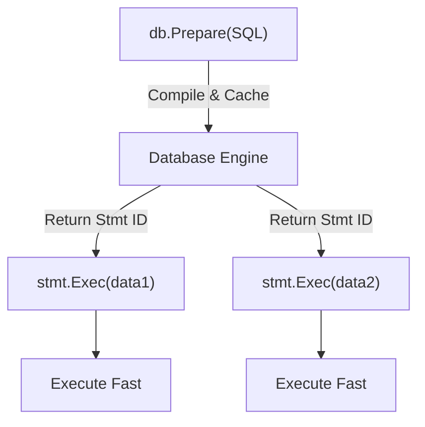

# DB.4 Prepared Statements

## Mission

Learn how to optimize your database interactions using Prepared Statements, reducing CPU overhead and improving the security and reliability of your SQL operations.

## Prerequisites

- `DB.3` select-queries

## Mental Model

Think of a Prepared Statement as **A Rubber Stamp**.

1. **Standard Query (Handwriting)**: Every time you send an order, you have to write out "Please send me 10 boxes of Apples" by hand. The receiver has to read your handwriting and figure out what you want every single time.
2. **Prepared Statement (The Stamp)**: You make a custom rubber stamp that says: "Please send me \_\_\_ boxes of \_\_\_". The receiver looks at the stamp once and knows exactly what it means. Now, you just write the numbers in the blanks and stamp the paper. It's faster for you and much easier for the receiver to process.

## Visual Model



## Machine View

When you call `db.Prepare`, the Go driver sends the SQL string to the database. The database then:
1. **Parses** the SQL to check for syntax errors.
2. **Analyzes** the table schema to check if columns exist.
3. **Optimizes** the query to create an efficient execution plan.
The database stores this plan and returns a "Statement ID". When you later call `stmt.Exec`, only the Statement ID and the raw data are sent over the network. This avoids the cost of re-parsing and re-optimizing the query on every call.

## Run Instructions

```bash
go run ./06-backend-db/01-web-and-database/databases/4-prepare
```

The example demonstrates preparing a single `INSERT` statement and reusing it to populate an inventory table.

## Code Walkthrough

### `db.Prepare(query)`
This initiates the preparation step. It returns a `*sql.Stmt` object. If the SQL has a syntax error, this is where you will catch it, even before you send any data.

### `defer stmt.Close()`
A prepared statement is a server-side resource. Just like a file or a network socket, you must close it when you're finished to free up memory on the database server.

### `stmt.Exec(args...)`
Executes the pre-compiled statement with the provided arguments. Since the structure is already known, this is significantly faster than a raw `db.Exec`.

### Reusability
In a production application, you might prepare common statements (like "Get User By ID" or "Update Session") once when the application starts and reuse them for the lifetime of the process.

## Try It

1. Create a prepared statement for a `SELECT` query and use it to fetch an item by its name.
2. What happens if you try to use a statement after calling `stmt.Close()`?
3. Compare the time it takes to insert 1,000 rows using raw `db.Exec` vs. a single `db.Prepare`.

## In Production
While prepared statements are great, they can be tricky with **Load Balancers**. If your load balancer switches your connection to a different database server mid-request, the new server might not have your statement cached. Most Go drivers handle this by "re-preparing" the statement on the new connection automatically, but it's something to be aware of when debugging performance issues in distributed systems.

## Thinking Questions
1. Why does a prepared statement need to be closed?
2. Is a prepared statement useful if you only plan to run the query once?
3. How does a prepared statement offer even better security than a simple parameterized query?

> **Forward Reference:** Prepared statements make individual queries faster. But what if you need a group of queries to succeed or fail as a single unit (like a bank transfer)? In [Lesson 5: Transactions](../5-transactions/README.md), you will learn how to use `db.Begin` to ensure data integrity.

## Next Step

Next: `DB.5` -> `06-backend-db/01-web-and-database/databases/5-transactions`

Open `06-backend-db/01-web-and-database/databases/5-transactions/README.md` to continue.
