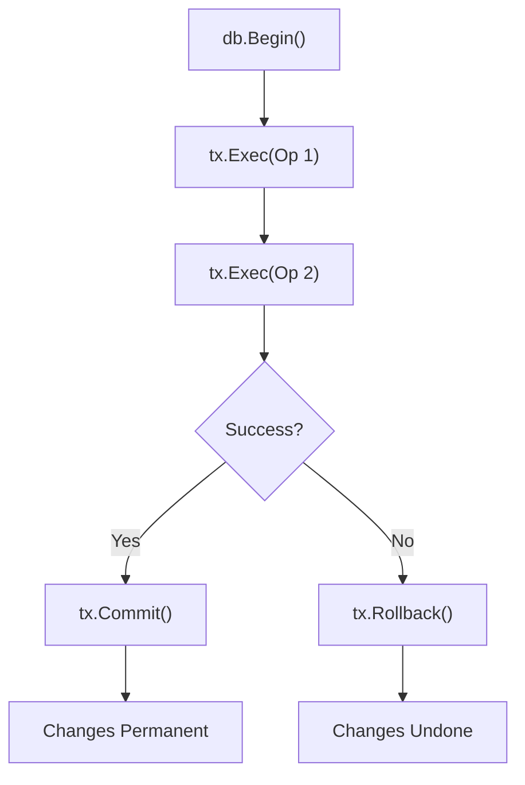

# DB.5 Transactions

## Mission

Understand the concept of atomicity and learn how to use SQL Transactions in Go to group multiple database operations into a single, reliable "all-or-nothing" unit of work.

## Prerequisites

- `DB.4` prepare-statements

## Mental Model

Think of a Transaction as **Making a Bank Transfer**.

1. **Operation A**: You subtract $100 from your account.
2. **Operation B**: You add $100 to your friend's account.
3. **The Problem**: If the power goes out after Step 1 but before Step 2, your $100 has vanished into thin air!
4. **The Solution**: You wrap both steps in a "Transaction Envelope". The money doesn't actually move until both steps are finished and you "seal" the envelope (Commit). If anything goes wrong, you just tear up the envelope (Rollback), and the money stays exactly where it was at the start.

## Visual Model



## Machine View

When you call `db.Begin`, the Go driver requests an **Exclusive Connection** from the pool.
- **Connection Affinity**: Every subsequent call using the `tx` object (like `tx.Exec`) is guaranteed to use that same physical connection. This is vital because database transactions are tied to a specific session/connection.
- **ACID**: Transactions provide Atomicity (All or nothing), Consistency (Rules are followed), Isolation (Other users can't see your partial work), and Durability (Once committed, it's saved forever).
- **Resource Lock**: Because the connection is locked, if your transaction takes too long, other goroutines might be blocked waiting for a connection to become free.

## Run Instructions

```bash
go run ./06-backend-db/01-web-and-database/databases/5-transactions
```

The example shows a successful transaction creating a user and a profile, followed by a failed transaction that rolls back correctly when a duplicate email is detected.

## Code Walkthrough

### `db.Begin()`
Starts the transaction and returns an `*sql.Tx` object.

### `defer tx.Rollback()`
This is the **"Safety First"** pattern in Go. By deferring the rollback immediately after starting, you ensure that if your code returns early (due to an error or a panic), the transaction is cleaned up. If `tx.Commit()` is called successfully, the deferred rollback will do nothing.

### `tx.Exec` vs `db.Exec`
This is a common mistake! You **must** use the `tx` object for all operations inside the transaction. If you use `db.Exec`, it will use a different connection from the pool and will not be part of your transaction!

### `tx.Commit()`
The final step. This tells the database: "Everything is good, make it permanent."

## Try It

1. In the failing transaction example, verify that the `profile` was NOT created even though the `user` insert technically "succeeded" before the error.
2. Add a third operation to the transaction (e.g., updating a `total_users` count in a different table).
3. Try starting a transaction and then letting the program sleep for 10 seconds. Observe if other database operations are blocked.

## In Production
**Keep Transactions Short.** Do not put non-database work inside a transaction.
- ❌ Begin -> Write DB -> **Call External API** -> Write DB -> Commit
- ✅ Begin -> Write DB -> Write DB -> Commit -> **Call External API**
Hogging a database connection while waiting for a slow network call is a recipe for a production outage.

## Thinking Questions
1. Why do we use `defer tx.Rollback()`?
2. What is the danger of using `db.Exec` inside a transaction block?
3. How does a transaction protect your data if the server crashes in the middle of a complex update?

> **Forward Reference:** You've mastered the raw SQL tools. But in a large application, having SQL strings scattered everywhere is a maintenance nightmare. In [Lesson 6: Repository Pattern](../6-repository/README.md), you will learn how to organize your database logic into clean, testable boundaries.

## Next Step

Next: `DB.6` -> `06-backend-db/01-web-and-database/databases/6-repository`

Open `06-backend-db/01-web-and-database/databases/6-repository/README.md` to continue.
