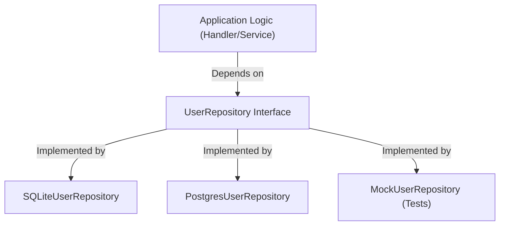

# DB.6 Repository pattern

## Mission

Learn how to organize your database logic into a clean, testable boundary using the Repository Pattern, ensuring your application logic remains decoupled from specific SQL implementations.

## Prerequisites

- `DB.5` transactions

## Mental Model

Think of the Repository Pattern as **A Personal Assistant for Data**.

1. **The Request**: You say to your assistant: "Get me the information for the user with email 'alice@example.com'."
2. **The Magic**: You don't care if the assistant goes to the filing cabinet (SQLite), calls another office (Microservice), or looks at their own notebook (Cache).
3. **The Result**: The assistant returns exactly what you asked for in a folder (The User Struct).
4. **The Interface**: Your relationship with the assistant is defined by what you can ask them to do, not by how they do it. This means you can replace your assistant with a new one (PostgreSQL) and your daily routine doesn't have to change at all.

## Visual Model



## Machine View

The Repository pattern uses **Dependency Injection (DI)**. Instead of your logic creating a database connection, the connection is passed (injected) into the repository struct. This allows you to:
- **Test in Isolation**: You can pass a "Mock" repository to your business logic tests that returns hardcoded data without ever touching a real database.
- **Switch Drivers**: You can swap your SQLite implementation for a high-performance PostgreSQL implementation just by changing the injection point in `main.go`.
- **Centralize SQL**: All SQL strings are contained in a single directory (`repository/`), making it easy to find and optimize slow queries.

## Run Instructions

```bash
go run ./06-backend-db/01-web-and-database/databases/6-repository
```

The example demonstrates a split structure with `models`, `repository`, and `main.go` working together to manage users and profiles.

## Solution Walkthrough

### `UserRepository` Interface
Defined in the `repository` package. It describes the **Intent** of our data access layer (Create, Get, List) without mentioning SQL or SQLite.

### `SQLUserRepository` Struct
The concrete implementation. It holds a pointer to `*sql.DB` and implements every method in the interface. Note that the methods use `context.Context` to support timeouts and cancellations.

### `models` Package
Contains our "Domain Models". These are simple structs that describe our data. Both the repository and the application logic use these shared models to communicate.

### Dependency Injection in `main.go`
In `main()`, we initialize the `*sql.DB` and then "Inject" it into the repository: `repo := repository.NewSQLUserRepository(db)`.

## Try It

1. Add a `Delete` method to the `UserRepository` interface and implement it in `SQLUserRepository`.
2. Try to create a second implementation called `MemoryUserRepository` that stores users in a simple Go `map` instead of a database.
3. Observe how easy it is to switch between the two implementations in `main.go`.

## Verification Surface

Running the repository project should show clean data management:

```text
=== Repository Pattern Project ===
   [DB] Connecting to SQLite...
   [REPO] Saving User: Alice
   [REPO] Saving Profile for User 1
   [APP] Fetching User 1 with Profile...
   [RESULT] User: Alice, Bio: Go Engineer
```

## In Production
While the Repository pattern is great, avoid the **"Generic Repository"** trap (trying to build one repository that handles all types of data). Each major domain (Users, Orders, Products) should have its own specific repository interface that reflects its unique business needs.

## Thinking Questions
1. Why is it better to return an interface from the repository constructor instead of a concrete struct?
2. How does the Repository pattern help with writing unit tests for your HTTP handlers?
3. What is the downside of having too many layers (Models -> Repository -> Service -> Handler)?

> **Forward Reference:** Your code is clean and organized. But as your data grows, you might accidentally write inefficient queries that perform thousands of small calls to the database. In [Lesson 7: N+1 Query Detection](../7-n-plus-one-query-detection/README.md), you will learn how to identify and fix one of the most common performance killers in backend engineering.

## Next Step

Next: `DB.7` -> `06-backend-db/01-web-and-database/databases/7-n-plus-one-query-detection`

Open `06-backend-db/01-web-and-database/databases/7-n-plus-one-query-detection/README.md` to continue.
