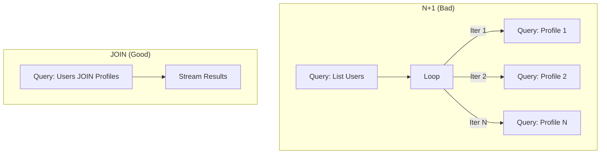

# DB.7 N+1 query detection

## Mission

Learn how to identify the "N+1 Query" performance anti-pattern and understand how to refactor your database access to use efficient JOINS and batching instead of loop-driven lookups.

## Prerequisites

- `DB.6` repository-pattern

## Mental Model

Think of the N+1 problem as **Going to the Grocery Store**.

1. **The Goal**: You need to buy 10 different items (Milk, Bread, Eggs, etc.).
2. **The N+1 Way (Inefficient)**: You drive to the store, buy Milk, drive home. Drive back to the store, buy Bread, drive home. Repeat this for all 10 items. You make **11** trips (1 for the list, 10 for the items).
3. **The Optimized Way (Efficient)**: You drive to the store once, pick up all 10 items in one basket, and drive home. You make **1** trip.

## Visual Model



## Machine View

The machine-level cost of a query is more than just the execution time on the CPU. It includes:
- **TCP/TLS Handshake**: Establishing or re-using a connection.
- **Round-Trip Time (RTT)**: The physical time it takes for bits to travel over the wire.
- **Connection Pool Overhead**: Acquiring and releasing a connection from the pool.
If your database is in a different region (e.g., your app is in US-East and DB is in US-West), the RTT might be 50ms. An N+1 loop for 100 users would add **5 seconds** of dead time to your request just from waiting for the network!

## Run Instructions

```bash
go run ./06-backend-db/01-web-and-database/databases/7-n-plus-one-query-detection
```

The example will run two different strategies to fetch the same data and print the total number of queries executed.

## Code Walkthrough

### The "Naive" Strategy
We perform one query to get the list of users. Then, for every user in the result set, we perform a *second* query to get their profile. This is common when using ORMs or when following the Repository pattern too strictly without "Eager Loading" support.

### The "Optimized" Strategy
We use an `INNER JOIN` (or `LEFT JOIN`) to combine the `users` and `profiles` tables into a single result set. The database is highly optimized for this operation. We send one SQL string and receive one stream of data.

### Identifying the Pattern
If you see a `db.Query` or `db.QueryRow` call inside a `for rows.Next()` loop, you have an N+1 problem.

## Try It

1. Increase the number of dummy users to 100 and compare the total queries.
2. What happens if a user doesn't have a profile? Use a `LEFT JOIN` and observe the difference.
3. Think about how you would solve N+1 if the profiles were stored in a completely different database or a third-party API. (Hint: Look up "IN clause batching").

## In Production
**N+1 is the #1 reason for slow backend performance.**
While it might not be noticeable on your laptop with 5 users, it becomes catastrophic in production with real load. Always prefer **JOINs** or **Batching** (using `WHERE id IN (?,?,?)`) when you know you will need related data for a list of items.

## Thinking Questions
1. Why do N+1 problems often go unnoticed during local development?
2. Is it ever okay to have an N+1 query pattern? (Hint: Think about extremely small datasets).
3. How does the Repository pattern sometimes encourage N+1 if you aren't careful?

> **Forward Reference:** You've optimized your queries. But what happens if the database is still slow or locked? You can't let your server wait forever. In [Lesson 8: Query Timeouts via Context](../8-query-timeouts-via-context/README.md), you will learn how to use `context.Context` to set strict time limits on every database operation.

## Next Step

Continue to `DB.8` query-timeouts-via-context.
