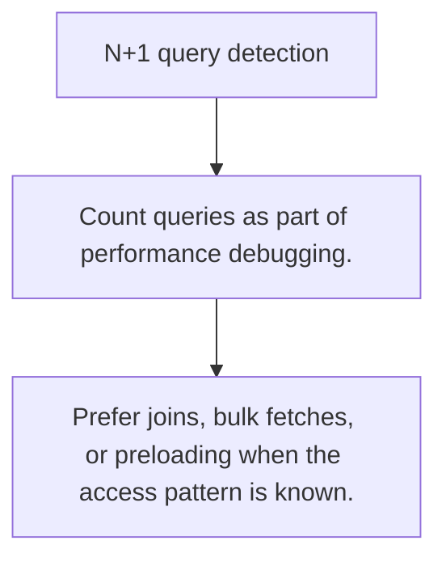

# DB.7 N+1 query detection

## Mission

Learn how repeated lookups inside a loop turn one logical query into unbounded database chatter.

## Prerequisites

- none

## Mental Model

The N+1 problem happens when one outer query hides many inner queries behind a loop.

## Visual Model



## Machine View

Each round-trip costs parsing, planning, network time, and pool usage even if every query looks small in isolation.

## Run Instructions

```bash
go run ./06-backend-db/01-web-and-database/databases/7-n-plus-one-query-detection
```

## Code Walkthrough

### Count queries as part of performance debugging.

Count queries as part of performance debugging.

### Spot repeated lookup patterns hidden inside loops.

Spot repeated lookup patterns hidden inside loops.

### Prefer joins, bulk fetches, or preloading when the acc

Prefer joins, bulk fetches, or preloading when the access pattern is known.

## Try It

1. Change one of the example inputs and rerun the lesson.
2. Explain which boundary the lesson is trying to make explicit.
3. Describe how you would apply DB.7 in a small service or tool.

## ⚠️ In Production

N+1 bugs usually surface first as latency spikes and database saturation under real load.

## 🤔 Thinking Questions

1. What problem does this topic solve?
2. What breaks if this boundary is handled implicitly instead of explicitly?
3. Where would you expect to use this topic in production Go code?

## Next Step

Continue to `DB.8`.
