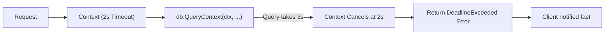

# DB.8 Query timeouts via context

## Mission

Learn how to implement deadline discipline in your database layer using `context.Context`, ensuring that slow or locked database calls cannot consume your server's resources indefinitely.

## Prerequisites

- `DB.7` n-plus-one-query-detection

## Mental Model

Think of a Query Timeout as **An Egg Timer in a Kitchen**.

1. **The Order**: A customer orders an omelet (A Database Query).
2. **The Timer**: You set an egg timer for 5 minutes.
3. **The Work**: The chef starts cooking.
4. **The Boundary**: If the bell rings and the omelet isn't finished, the chef stops immediately and throws it away. The customer is told: "Sorry, the kitchen is too busy right now."
5. **The Benefit**: Without the timer, the chef might spend an hour on one stuck omelet, while 50 other customers wait and eventually the whole restaurant fills with smoke.

## Visual Model



## Machine View

In Go, every `sql` method has a "Context" version (e.g., `ExecContext`, `QueryContext`, `QueryRowContext`).
When you pass a context with a timeout:
1. **The Timer**: Go starts a timer in the background.
2. **The Handshake**: The database driver sends the query to the database server.
3. **The Interruption**: If the timer finishes before the database responds, Go immediately stops waiting, severs the network connection (or sends a cancel packet), and returns the error `context.DeadlineExceeded`.
This is critical for **Resource Management**. An open database connection that is just "waiting" is a wasted slot in your connection pool.

## Run Instructions

```bash
go run ./06-backend-db/01-web-and-database/databases/8-query-timeouts-via-context
```

The example demonstrates a fast query that succeeds and a query with an impossible 10-microsecond budget that correctly triggers a timeout error.

## Code Walkthrough

### `context.WithTimeout`
Creates a copy of the parent context with a specific duration. Always call the `cancel` function to ensure resources are cleaned up even if the query finishes early.

### `db.QueryRowContext(ctx, ...)`
The "Context-aware" version of the query method. It takes the context as its first argument and respects its deadline.

### `context.DeadlineExceeded`
The specific error returned when a timeout occurs. You can check for this to differentiate between a "Database is Down" error and a "Database is too Slow" error.

## Try It

1. Change the timeout to 1 second and see if the query succeeds.
2. Try setting a timeout on a transaction using `db.BeginTx(ctx, nil)`.
3. What happens if you use `context.Background()` instead of a timeout context? (Hint: It will wait forever!).

## In Production
**Set timeouts on EVERYTHING.**
A safe default for simple database queries is often between 500ms and 5 seconds. If a query takes longer than 5 seconds in an interactive web app, your user has likely already left. For background jobs (like generating reports), you might set a longer timeout (e.g., 5 minutes), but there should **always** be a limit.

## Thinking Questions
1. Why is it important to use `defer cancel()` after creating a timeout context?
2. How does a database timeout help prevent "Cascading Failures" in a system with many microservices?
3. If a query times out, does it definitely stop running on the database server? (Hint: It depends on the driver and the database!).

> [!TIP]
> You have completed the Backend and Database section! You are now equipped to build production-grade, reliable, and efficient services. In [Section 07: Concurrency](../../../../07-concurrency/README.md), you will learn how to take your performance to the next level by running multiple operations in parallel.

## Next Step

Next: `GC.0` -> [`07-concurrency/01-concurrency/goroutines/0-why-concurrency-exists`](../../../../07-concurrency/01-concurrency/goroutines/0-why-concurrency-exists/README.md)
