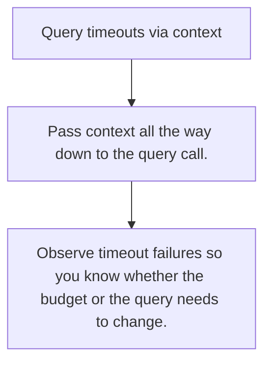

# DB.8 Query timeouts via context

## Mission

Learn how context deadlines stop slow database operations from owning a request forever.

## Prerequisites

- DB.7

## Mental Model

A query timeout is a budget, not a guess. It bounds how long one dependency can hold the caller.

## Visual Model



## Machine View

Database drivers and pools respect context by cancelling or abandoning work when the deadline expires.

## Run Instructions

```bash
go run ./06-backend-db/01-web-and-database/databases/8-query-timeouts-via-context
```

## Code Walkthrough

### Pass context all the way down to the query call.

Pass context all the way down to the query call.

### Separate request budgets from database budgets intenti

Separate request budgets from database budgets intentionally.

### Observe timeout failures so you know whether the budge

Observe timeout failures so you know whether the budget or the query needs to change.

## Try It

1. Change one of the example inputs and rerun the lesson.
2. Explain which boundary the lesson is trying to make explicit.
3. Describe how you would apply DB.8 in a small service or tool.

## ⚠️ In Production

Deadline discipline keeps one bad dependency call from consuming the whole request budget or worker pool.

## 🤔 Thinking Questions

1. What problem does this topic solve?
2. What breaks if this boundary is handled implicitly instead of explicitly?
3. Where would you expect to use this topic in production Go code?

## Next Step

Use this lesson as a reference surface before moving to the next track in the section.
