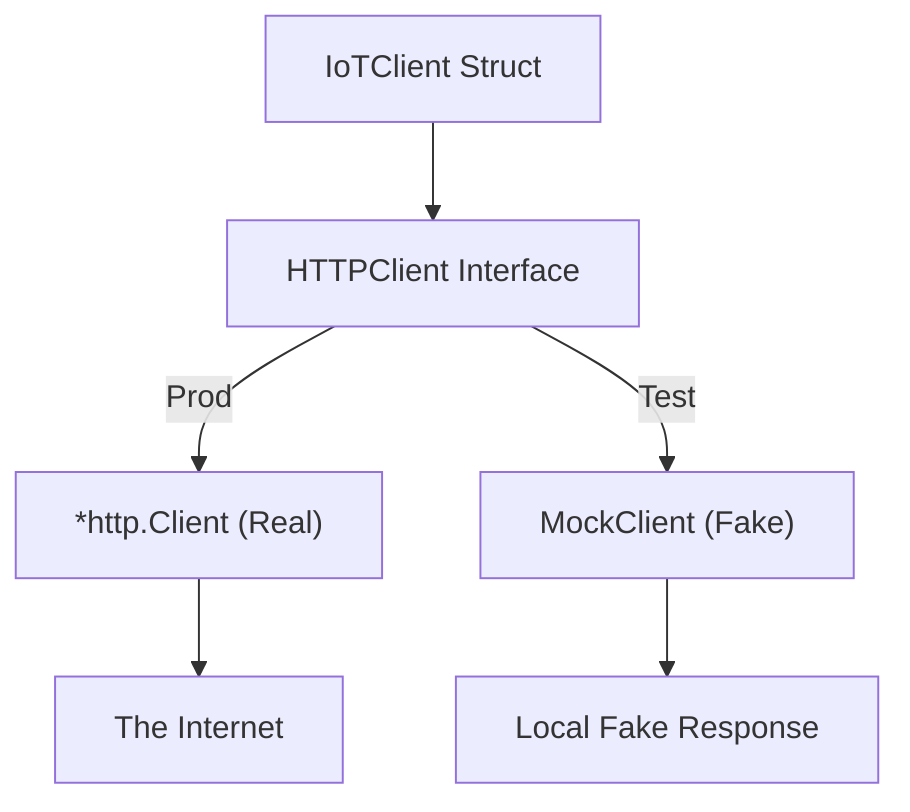

# HCL.2 Refactor for Testability

## Mission

Learn how to use interfaces and dependency injection to decouple your code from the real network, making your HTTP client logic 100% unit-testable without ever making a real network call.

## Prerequisites

- `HCL.1` get-posts

## Mental Model

Think of Refactoring for Testability as **Installing a Universal Wall Outlet**.

1. **The Hardcoded Way**: Imagine your toaster is hardwired directly into the city's power plant. If the power plant goes down, you can't test your toaster.
2. **The Interface (The Outlet)**: You install a standard 3-prong outlet. The toaster doesn't care where the electricity comes from; it just needs a plug that fits.
3. **The Real Client (The Grid)**: In production, you plug the outlet into the real power grid (The Internet).
4. **The Mock Client (The Generator)**: During a test, you plug the outlet into a small portable generator (A Mock). The toaster works exactly the same way, but you have full control over the power source.

## Visual Model



## Machine View

In Go, interfaces are satisfied **Implicitly**. If a struct has a method that matches the interface signature, it *is* that interface.
By defining `type HTTPClient interface { Get(url string) (*http.Response, error) }`, we create a contract.
Because `*http.Client` already has a `Get` method with that exact signature, it satisfies our interface automatically.
This allows us to write an `IoTClient` that accepts *any* struct that has a `Get` method, giving us a "Hook" to inject fake behavior during tests.

## Run Instructions

```bash
go run ./06-backend-db/01-web-and-database/http-client/2-refactor-for-testability
```

## Code Walkthrough

### The `HTTPClient` Interface
This is our "Contract." It only cares about the *behavior* (making a GET request), not the implementation details (like timeouts or connection pools).

### The `IoTClient` Struct
Notice that `httpClient` is a field of type `HTTPClient` (the interface). We no longer call `http.Get` globally; we call `c.httpClient.Get`.

### Constructor Injection
The `NewIoTClient` function requires an `HTTPClient` as an argument. This forces the caller to provide a client, making dependencies explicit.

### Implicit Satisfaction
In `main()`, we pass a `*http.Client`. Go sees that it has a `Get` method and allows it to be used as an `HTTPClient`. No "implements" keyword required!

## Try It

1. Create a `MockClient` struct in `main.go` that implements the `Get` method and returns a hardcoded "Sensor Failure" response.
2. Inject your `MockClient` into the `NewIoTClient` and observe that the code runs without making a network request.
3. Add a `Post` method to the `HTTPClient` interface and update the `IoTClient` to use it.

## In Production
**Always Use a Custom Client.**
Even when injecting a client, make sure the one you inject has a `Timeout` set. Refactoring for testability makes your code *cleaner*, but it doesn't automatically make it *safer* if you still pass a `DefaultClient` under the hood.

## Thinking Questions
1. Why is it better to mock an interface rather than starting a real test server?
2. How does dependency injection help with "Seams" in your architecture?
3. Can you think of other external dependencies (besides HTTP) that should be hidden behind interfaces?

> [!TIP]
> You can now build and test HTTP clients. Now it's time to learn how to build the APIs they talk to! In [Lesson 1: REST Design Principles](../../apis/1-rest-design-principles/README.md), you will learn the theory behind building truly professional, scalable web interfaces.

## Next Step

Continue to `API.1` rest-design-principles.
