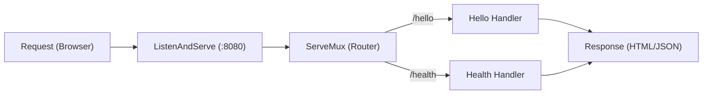

# HS.1 net/http basics

## Mission

Understand the fundamental architecture of a Go HTTP server and learn how to build a basic web service using only the standard library.

## Prerequisites

- `FS.8` fs-testing-seam

## Mental Model

Think of an HTTP server as a **Receptionist in a Large Office Building**.

1. **The Listener (Front Door)**: `http.ListenAndServe` stands at the front door, waiting for people (requests) to walk in.
2. **The Router (Directory Board)**: `http.ServeMux` is the directory board that tells the receptionist where to send each person based on what they are looking for (the URL path).
3. **The Handler (Office Clerk)**: Each `http.Handler` is a clerk in a specific office who knows how to handle a specific request.
4. **The Tools**: The clerk uses a **Form** (`*http.Request`) to read what the person wants and a **Stamp/Envelope** (`http.ResponseWriter`) to send back the answer.

## Visual Model



## Machine View

At the machine level, an HTTP server is a long-running loop that accepts TCP connections. For each connection, Go spawns a new **Goroutine** to handle the request. This means your server can handle thousands of concurrent users out of the box. The `http.ResponseWriter` is an interface that eventually writes bytes to the TCP socket, while `*http.Request` is a struct containing parsed data from the HTTP packet (headers, method, body, etc.).

## Run Instructions

```bash
go run ./06-backend-db/01-web-and-database/http-servers/1-net-http-basics
```

Once running, open your browser to `http://localhost:8080`.

## Code Walkthrough

### `http.ServeMux`
The "Multiplexer". It matches incoming URL paths to specific handler functions. In Go, the `/` pattern matches everything, so it's often used as a catch-all root handler.

### `http.HandlerFunc`
A clever type conversion. It allows you to use a regular function with the signature `func(w http.ResponseWriter, r *http.Request)` as an HTTP handler.

### `http.ResponseWriter`
This is what you use to send data back to the client. You can set status codes with `w.WriteHeader()`, set headers with `w.Header().Set()`, and send the body with `w.Write()`.

### `http.ListenAndServe`
The function that starts the engine. It blocks the main goroutine and keeps the program running until the server is shut down or an error occurs.

## Try It

1. Add a new route `/time` that responds with the current server time.
2. Change the port from `:8080` to `:9000` and verify you can still reach the server.
3. Try sending a request to a path that isn't registered (e.g., `/random`) and see how the `ServeMux` handles it.

## In Production
While `http.ListenAndServe` is great for learning, in production you should use `http.Server` struct directly to set **Timeouts**. A server without timeouts can be easily taken down by "Slowloris" attacks where clients open connections but never send data. We will cover this in `HS.7`.

## Thinking Questions
1. Why does Go start a new goroutine for every request?
2. What happens if two routes overlap (e.g., `/` and `/health`)?
3. How does `http.ResponseWriter` handle cases where you forget to set a status code?

> **Forward Reference:** You've built a basic server, but what happens when you have dozens of complex routes with variables in the path? In [Lesson 2: Routing Patterns](../2-routing-patterns/README.md), we will dive into advanced routing techniques and RESTful design.

## Next Step

Continue to `HS.2` routing-patterns.
