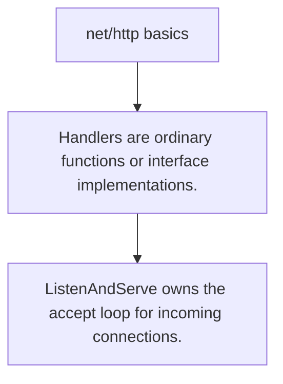

# HS.1 net/http basics

## Mission

Learn the smallest useful shape of an HTTP server in Go.

## Prerequisites

- none

## Mental Model

A handler is the unit of HTTP work. A mux decides which handler should receive each request.

## Visual Model



## Machine View

Go keeps HTTP server primitives small: handlers, muxes, listeners, and request/response values.

## Run Instructions

```bash
go run ./06-backend-db/01-web-and-database/http-servers/1-net-http-basics
```

## Code Walkthrough

### Handlers are ordinary functions or interface implement

Handlers are ordinary functions or interface implementations.

### ServeMux routes requests by pattern.

ServeMux routes requests by pattern.

### ListenAndServe owns the accept loop for incoming conne

ListenAndServe owns the accept loop for incoming connections.

## Try It

1. Change one of the example inputs and rerun the lesson.
2. Explain which boundary the lesson is trying to make explicit.
3. Describe how you would apply HS.1 in a small service or tool.

## ⚠️ In Production

The stdlib server is enough for most internal services and a strong baseline for external APIs too.

## 🤔 Thinking Questions

1. What problem does this topic solve?
2. What breaks if this boundary is handled implicitly instead of explicitly?
3. Where would you expect to use this topic in production Go code?

## Next Step

Continue to `HS.2`.
