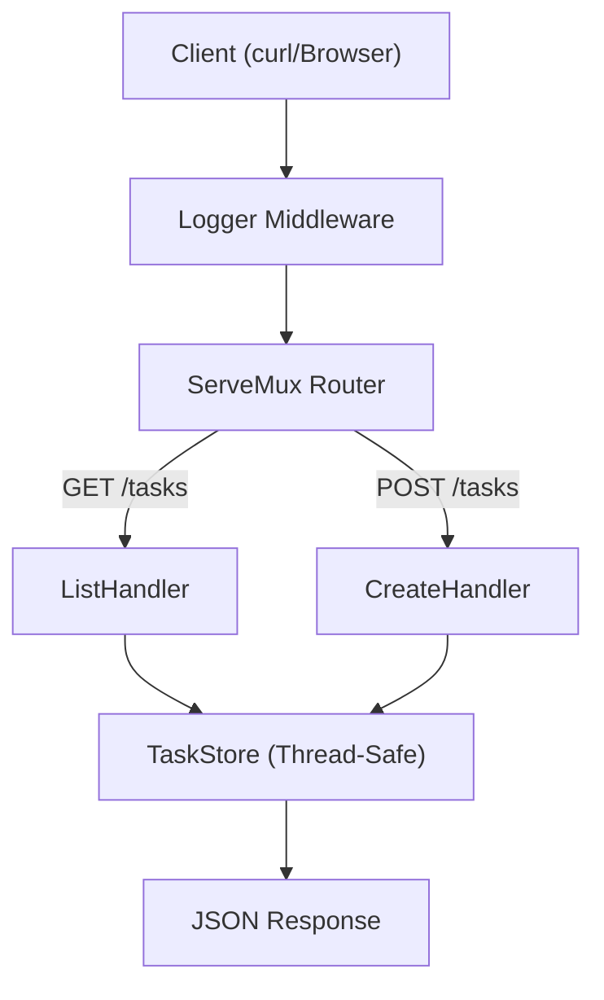

# HS.10 REST API Exercise

## Mission

Combine everything you have learned about HTTP servers into a single, functional Task Management API. You will implement CRUD operations, persistent (in-memory) state, middleware, and graceful shutdown in one cohesive project.

## Prerequisites

- `HS.1` through `HS.9`

## Mental Model

Think of this project as **Building a Complete Digital Library**.

1. **The Building (`http.Server`)**: The physical structure with security and rules.
2. **The Front Desk (`ServeMux`)**: Where people go to ask for specific things.
3. **The Librarian (`TaskAPI`)**: The professional who knows how to handle books (tasks).
4. **The Catalog (`TaskStore`)**: The list of all books, carefully protected from multiple librarians working at once (`sync.RWMutex`).
5. **The Records (`Middleware`)**: A log of everyone who enters and leaves.

## Visual Model



## Machine View

This exercise demonstrates **Composition over Inheritance**. We don't use a "Base Server" class. Instead, we compose a `Server` from a `Mux`, compose the `Mux` from handlers, and protect our in-memory data using Go's `sync` primitives. The `TaskStore` keeps ID creation and map writes behind one mutex so concurrent HTTP requests cannot corrupt the task list.

## Run Instructions

```bash
go run ./06-backend-db/01-web-and-database/http-servers/10-rest-api-exercise
```

**Testing the CRUD Flow:**

1. **List Tasks**: `curl http://localhost:8080/tasks`
2. **Create Task**: `curl -X POST -d '{"title": "Complete Go Section"}' http://localhost:8080/tasks`
3. **Get Specific Task**: `curl http://localhost:8080/tasks/1`
4. **Delete Task**: `curl -X DELETE http://localhost:8080/tasks/1`

## Solution Walkthrough

### The `TaskStore`
Notice the use of `sync.RWMutex`. This is critical because HTTP handlers run concurrently. If two requests try to write to the `tasks` map at the same time, the program will crash with a "concurrent map write" error. The `RWMutex` allows multiple readers to look at the list but only one writer to modify it.

### `TaskAPI` Struct
We group our handlers onto a struct. This allows them to share access to the `TaskStore` without using global variables, making the code easier to test and maintain.

### Helper Functions
`respondJSON` and `respondError` reduce boilerplate. In a real project, these might be moved to a shared `internal/api` package.

### Graceful Shutdown
We include the full signal-handling logic from `HS.8` to ensure that even a complex API like this can exit cleanly without losing data that might be in the middle of being processed.

## Try It

1. Add a `PUT /tasks/{id}` route to allow updating a task's title or completion status.
2. Add a `/search?title=...` query parameter to the List handler to filter tasks.
3. Implement a "Soft Delete" by adding a `DeletedAt` field to the `Task` struct instead of removing it from the map.

## Verification Surface

When you run this exercise, the process starts a real HTTP server and waits for a shutdown signal:

```text
=== Task Management REST API ===

  Server starting on http://localhost:8080
  Use curl to interact with the API:
    - GET /tasks
    - POST /tasks -d '{"title": "Learn Go"}'
```

The automated test suite uses `httptest` to cover the handlers directly. That keeps `go test ./...` fast and deterministic instead of launching a long-running server process.

## In Production
In a real production environment, you would never store your data in an in-memory map. If the server restarts, all data is lost! In the following modules (Section 06 / Databases), you will learn how to replace this `TaskStore` with a real SQLite or PostgreSQL database.

## Thinking Questions
1. Why is `sync.RWMutex` better than a regular `sync.Mutex` for a task list?
2. How would you handle a situation where two people try to update the same task at the same time? (Optimistic Locking).
3. What are the benefits of grouping handlers on a struct instead of using top-level functions?

> **Forward Reference:** You have mastered the "how" of building HTTP servers. Now, let's focus on the "why" and "how best" of API design. In [Section 06: APIs / Lesson 1: REST Design Principles](../../apis/1-rest-design-principles/README.md), you will learn the theory behind building truly professional, scalable web interfaces.

## Next Step

Continue to `API.1` rest-design-principles.
