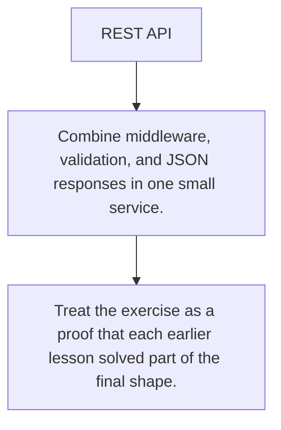

# HS.10 REST API

## Mission

Build a small REST-shaped surface that combines routing, middleware, validation, and consistent responses.

## Prerequisites

- HS.1
- HS.2
- HS.3
- HS.4
- HS.5
- HS.6
- HS.7
- HS.8
- HS.9

## Mental Model

A real API is the composition of many smaller rules: routing, parsing, error handling, and stable payload contracts.

## Visual Model



## Machine View

The final shape matters less than the discipline of keeping transport concerns explicit and reusable.

## Run Instructions

```bash
go run ./06-backend-db/01-web-and-database/http-servers/10-rest-api-exercise
```

## Solution Walkthrough

- Combine middleware, validation, and JSON responses in one small service.
- Use consistent status codes for create, read, and failure paths.
- Treat the exercise as a proof that each earlier lesson solved part of the final shape.

## Verification Surface

- Use `go run ./06-backend-db/01-web-and-database/http-servers/10-rest-api-exercise`.
- Starter path: `06-backend-db/01-web-and-database/http-servers/10-rest-api-exercise/_starter`.

## Try It

1. Change one of the example inputs and rerun the lesson.
2. Explain which boundary the lesson is trying to make explicit.
3. Describe how you would apply HS.10 in a small service or tool.

## ⚠️ In Production

Exercise surfaces are where transport choices become habits that carry into real service work.

## 🤔 Thinking Questions

1. What problem does this topic solve?
2. What breaks if this boundary is handled implicitly instead of explicitly?
3. Where would you expect to use this topic in production Go code?

## Next Step

Use this lesson as a reference surface before moving to the next track in the section.
