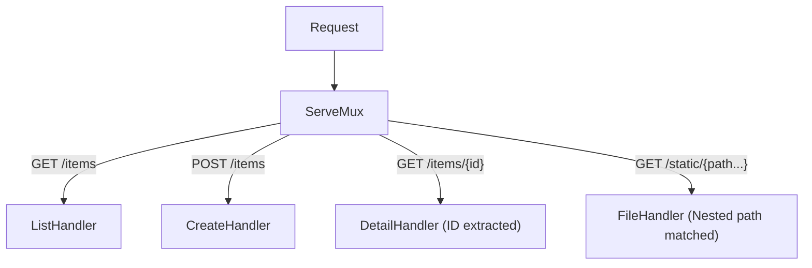

# HS.2 Routing Patterns

## Mission

Master modern Go 1.22+ routing techniques, including method matching, path parameters, and wildcard handling, to build structured and expressive APIs.

## Prerequisites

- `HS.1` net/http-basics

## Mental Model

Think of the router as a **Smart Mailroom**.

In a basic mailroom (`HS.1`), letters are sorted only by the address (the path). If a letter is sent to `/billing`, it goes to the billing office, regardless of whether it's an Inquiry or a Payment.

In a **Smart Mailroom** (`HS.2`):
1. **Method Check**: The sorter looks at the color of the envelope (the HTTP Method). Blue envelopes (GET) go to the information desk. Red envelopes (POST) go to the processing department.
2. **Variable Extraction**: The sorter can read specific parts of the address. If an address says `/users/123`, the sorter knows `123` is the User ID and hands that number to the clerk.
3. **Wildcards**: If an address says `/docs/...`, the sorter knows everything following `/docs/` belongs to the Documentation department, no matter how many sub-folders are involved.

## Visual Model



## Machine View

Since Go 1.22, the `http.ServeMux` uses a more sophisticated matching algorithm. Patterns are now parsed into segments. If a pattern starts with a method (like `GET`), it only matches requests with that method. Variables like `{id}` match a single segment, and their values are stored in the `context.Context` of the request, accessible via `r.PathValue()`. This is highly efficient and happens during the routing phase, so your handlers don't have to manually parse strings from `r.URL.Path`.

## Run Instructions

```bash
go run ./06-backend-db/01-web-and-database/http-servers/2-routing-patterns
```

Test the routes using a browser or `curl`:
```bash
# Test path parameter
curl http://localhost:8081/items/456

# Test wildcard
curl http://localhost:8081/files/assets/images/logo.png
```

## Code Walkthrough

### Method Prefixing
`"GET /items"` ensures that the handler only runs for GET requests. If a user sends a POST request to `/items`, the server will automatically respond with `405 Method Not Allowed`.

### Path Variables `{name}`
The `{id}` syntax captures a segment of the URL. Use `r.PathValue("id")` inside the handler to retrieve it. This is the modern way to build RESTful resources like `/users/{uid}/posts/{pid}`.

### Wildcards `{name...}`
The ellipsis `...` indicates that this segment and all subsequent segments should be captured. This is essential for serving files or building proxy servers.

### Precedence Rules
If multiple patterns match, Go uses a "Most Specific Match" rule. For example, `GET /items/special` is more specific than `GET /items/{id}`, so it will take priority if a request comes in for exactly `/items/special`.

## Try It

1. Create a route that handles both `PUT` and `PATCH` for the same resource.
2. Implement a route `/math/{op}/{a}/{b}` and write a handler that performs the requested operation.
3. Verify that the server returns a `405` error if you try to `GET` a route registered only for `POST`.

## In Production
While the standard library router is now very capable, it does not support **Regular Expression** matching in paths. If your routing requirements are extremely complex (e.g., matching only IDs that are exactly 8 digits long), you might still need a regex-capable router like **Chi** or **Gorilla Mux**. However, for most production APIs, the standard library is cleaner and safer.

## Thinking Questions
1. Why is it better to match methods in the router instead of inside the handler function?
2. What is the difference between `/path/` (trailing slash) and `/path` in Go routing?
3. How would you handle a request where a required path parameter is missing?

> **Forward Reference:** Now that you can route requests to the right handlers, how do you handle cross-cutting concerns like logging every request or checking for authentication? In [Lesson 3: Middleware Pattern](../3-middleware-pattern/README.md), you will learn how to wrap your handlers with reusable logic.

## Next Step

Continue to `HS.3` middleware-pattern.
