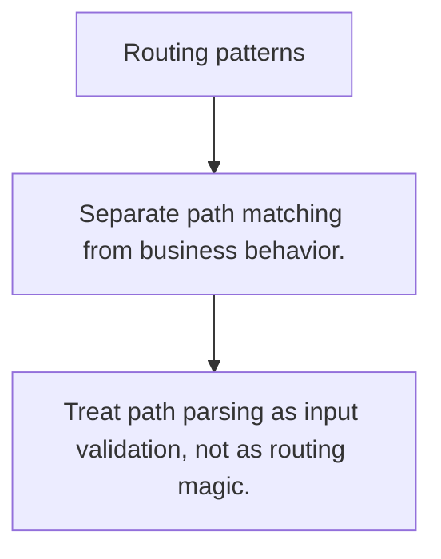

# HS.2 Routing patterns

## Mission

Learn how route patterns, method checks, and path parsing shape request flow.

## Prerequisites

- HS.1

## Mental Model

Routing is the first decision boundary in a server: find the path, check the verb, then pass the request into domain logic.

## Visual Model



## Machine View

Routers translate bytes from the request line into a handler choice before business logic runs.

## Run Instructions

```bash
go run ./06-backend-db/01-web-and-database/http-servers/2-routing-patterns
```

## Code Walkthrough

### Separate path matching from business behavior.

Separate path matching from business behavior.

### Reject wrong HTTP methods early and clearly.

Reject wrong HTTP methods early and clearly.

### Treat path parsing as input validation, not as routing

Treat path parsing as input validation, not as routing magic.

## Try It

1. Change one of the example inputs and rerun the lesson.
2. Explain which boundary the lesson is trying to make explicit.
3. Describe how you would apply HS.2 in a small service or tool.

## ⚠️ In Production

Route clarity matters because it keeps handlers focused and makes debugging mismatches fast.

## 🤔 Thinking Questions

1. What problem does this topic solve?
2. What breaks if this boundary is handled implicitly instead of explicitly?
3. Where would you expect to use this topic in production Go code?

## Next Step

Continue to `HS.3`.
