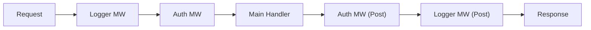

# HS.3 Middleware Pattern

## Mission

Learn how to use the middleware pattern to build a structured, layered request pipeline that separates cross-cutting concerns from your business logic.

## Prerequisites

- `HS.2` routing-patterns

## Mental Model

Think of middleware as **Layers of an Onion**.

1. **The Core**: The center of the onion is your **Handler** (the business logic).
2. **The Layers**: Each layer of the onion is a piece of **Middleware**.
3. **The Request**: A request comes from the outside and must pass through every layer (Logging, Auth, Compression) to reach the core.
4. **The Response**: Once the core finishes its work, the response travels back out through the same layers in reverse order.

## Visual Model



## Machine View

In Go, middleware is implemented via function composition. A middleware function takes an `http.Handler` and returns a new `http.Handler`. Inside this new handler, you can execute code before calling `next.ServeHTTP(w, r)` and code after it. Because `http.Handler` is a simple interface, these layers can be nested infinitely. The "After" code is guaranteed to run (unless the program crashes) because the call to `next` is synchronous.

## Run Instructions

```bash
go run ./06-backend-db/01-web-and-database/http-servers/3-middleware-pattern
```

Check the terminal output to see the logs generated by the `Logger` middleware as you refresh the page in your browser.

## Code Walkthrough

### The Middleware Signature
`func(http.Handler) http.Handler`
This is the standard signature. It accepts the "next" handler in the chain and returns a wrapper that implements the `http.Handler` interface.

### `http.HandlerFunc` Adapter
Just like in `HS.1`, we use `http.HandlerFunc` to turn an anonymous function into a type that satisfies the `http.Handler` interface.

### Executing "Before" Logic
Anything written before the `next.ServeHTTP` call happens on the way **IN**. This is where you validate tokens, start timers, or set default headers.

### Executing "After" Logic
Anything written after the `next.ServeHTTP` call happens on the way **OUT**. This is where you log completion times, clean up resources, or record metrics.

### Chaining Middleware
`MiddlewareA(MiddlewareB(Handler))`
The outermost middleware runs first. If you have many layers, you can create a `Chain` helper function to keep the code readable.

## Try It

1. Create a `Recovery` middleware that uses `recover()` to catch panics and prevent the server from crashing.
2. Implement a `RequestID` middleware that adds a unique UUID to every request header.
3. Change the order of the middleware in `main.go` and observe how the logs or headers change.

## In Production
Be careful with **State** in middleware. Since handlers run in concurrent goroutines, any variables shared between requests (like a counter inside the middleware struct) must be protected by a `sync.Mutex` or `atomic` values to avoid race conditions. Most middleware should be stateless.

## Thinking Questions
1. Why do we pass the `http.Handler` instead of just a function?
2. What happens if a middleware doesn't call `next.ServeHTTP`? (This is called "Short-Circuiting").
3. How can you share data between middleware (e.g., passing a UserID from an Auth middleware to the final handler)?

> **Forward Reference:** You can now wrap your logic with powerful infrastructure layers. But eventually, your handler needs to look inside the request to find data. In [Lesson 4: Request Parsing and Validation](../4-request-parsing-and-validation/README.md), you will learn how to safely extract and validate JSON, Query Params, and Form data.

## Next Step

Next: `HS.4` -> `06-backend-db/01-web-and-database/http-servers/4-request-parsing-and-validation`

Open `06-backend-db/01-web-and-database/http-servers/4-request-parsing-and-validation/README.md` to continue.
