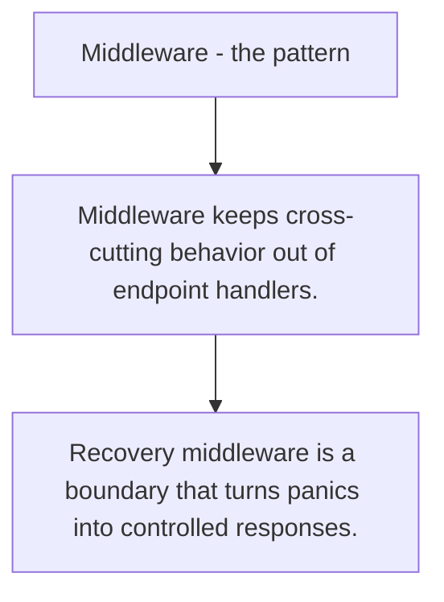

# HS.3 Middleware - the pattern

## Mission

Learn how middleware wraps handlers to add logging, auth, recovery, and cross-cutting rules.

## Prerequisites

- HS.2

## Mental Model

Middleware is a handler that returns another handler. Each layer adds one concern around the real work.

## Visual Model



## Machine View

Wrapping preserves the same request/response contract while inserting extra behavior before and after the next layer runs.

## Run Instructions

```bash
go run ./06-backend-db/01-web-and-database/http-servers/3-middleware-pattern
```

## Code Walkthrough

### Middleware keeps cross-cutting behavior out of endpoin

Middleware keeps cross-cutting behavior out of endpoint handlers.

### Ordering matters because outer layers run before and a

Ordering matters because outer layers run before and after inner ones.

### Recovery middleware is a boundary that turns panics in

Recovery middleware is a boundary that turns panics into controlled responses.

## Try It

1. Change one of the example inputs and rerun the lesson.
2. Explain which boundary the lesson is trying to make explicit.
3. Describe how you would apply HS.3 in a small service or tool.

## ⚠️ In Production

Keep middleware small and composable so one stack does not become a hidden framework.

## 🤔 Thinking Questions

1. What problem does this topic solve?
2. What breaks if this boundary is handled implicitly instead of explicitly?
3. Where would you expect to use this topic in production Go code?

## Next Step

Continue to `HS.4`.
