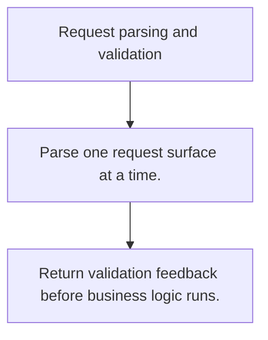

# HS.4 Request parsing and validation

## Mission

Learn how to decode request data deliberately and reject malformed input early.

## Prerequisites

- HS.3

## Mental Model

Parsing turns transport bytes into domain values. Validation decides whether those values are safe to trust.

## Visual Model



## Machine View

HTTP requests expose headers, query strings, paths, and bodies as different surfaces with different failure modes.

## Run Instructions

```bash
go run ./06-backend-db/01-web-and-database/http-servers/4-request-parsing-and-validation
```

## Code Walkthrough

### Parse one request surface at a time.

Parse one request surface at a time.

### Limit body size before decoding it.

Limit body size before decoding it.

### Return validation feedback before business logic runs.

Return validation feedback before business logic runs.

## Try It

1. Change one of the example inputs and rerun the lesson.
2. Explain which boundary the lesson is trying to make explicit.
3. Describe how you would apply HS.4 in a small service or tool.

## ⚠️ In Production

Most API bugs start at the boundary. Size limits, decode errors, and validation checks should fail fast.

## 🤔 Thinking Questions

1. What problem does this topic solve?
2. What breaks if this boundary is handled implicitly instead of explicitly?
3. Where would you expect to use this topic in production Go code?

## Next Step

Continue to `HS.5`.
