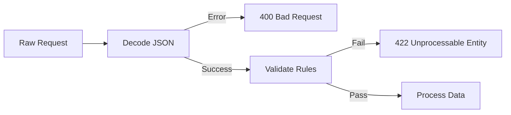

# HS.4 Request Parsing and Validation

## Mission

Learn how to safely extract, decode, and validate incoming data from HTTP request bodies and URL parameters to ensure your server processes only high-quality, trusted data.

## Prerequisites

- `HS.3` middleware-pattern

## Mental Model

Think of request parsing as an **Airport Security Checkpoint**.

1. **The Passenger**: The incoming `*http.Request`.
2. **The Scanner (Parsing)**: The code that unrolls the luggage (JSON decoding) and checks the pockets (Query parameters).
3. **The Prohibited Items List (Validation)**: Your business rules. Does the user have an email? Is the age a positive number?
4. **The Gate**: If the scan and check pass, the passenger moves on to the destination (the business logic). Otherwise, they are turned away with an explanation (`400 Bad Request`).

## Visual Model



## Machine View

Data comes in over the network as a stream of bytes. For the body, Go provides `r.Body`, which is an `io.ReadCloser`. It's crucial to understand that the body can only be read **once**. `json.NewDecoder(r.Body)` is preferred over reading the whole body into memory with `ReadAll` because it streams the data directly into your struct, which is significantly faster and uses less memory for large requests. Query parameters are handled differently; they are already parsed by the server and available in the `r.URL.Query()` map.

## Run Instructions

```bash
go run ./06-backend-db/01-web-and-database/http-servers/4-request-parsing-and-validation
```

Test the validation logic using `curl`:
```bash
# Valid Request
curl -X POST -d '{"username":"bob", "email":"bob@work.com", "age":30}' http://localhost:8083/users

# Invalid Age (Triggering validation error)
curl -X POST -d '{"username":"kid", "email":"kid@play.com", "age":10}' http://localhost:8083/users

# Bad JSON (Triggering parsing error)
curl -X POST -d '{"username":"oops", "age": "twenty"}' http://localhost:8083/users
```

## Code Walkthrough

### `json.NewDecoder`
The standard way to parse JSON bodies. It connects an `io.Reader` directly to a struct. Always check the error returned by `Decode()`-it will tell you if the JSON was malformed or if the types didn't match.

### `r.URL.Query()`
This returns a `url.Values` object, which is essentially a `map[string][]string`. Note that one key can have multiple values (e.g., `?tag=go&tag=web`). Use `.Get("key")` to get the first value for that key.

### The `Validate()` Method
A clean pattern for validation is to define a method on your request struct. This keeps the handler focused on HTTP concerns (parsing/responding) and the struct focused on data integrity.

### Status Codes for Errors
- `400 Bad Request`: Use this when the input format is wrong (malformed JSON).
- `422 Unprocessable Entity`: Use this when the format is correct, but the data violates business rules (e.g., email missing).

## Try It

1. Add a `Password` field to the `UserRequest` struct and validate that it is at least 8 characters long.
2. Modify the search handler to handle multiple tags using `r.URL.Query()["tags"]`.
3. Create a helper function `respondWithError(w, code, message)` to dry up your error handling logic.

## In Production
For complex validation, most Go teams use a validation library like **Go-Playground/Validator**. It allows you to define rules using struct tags, like `validate:"required,email"`. However, for simple logic, manual validation as shown in this lesson is more performant and easier to debug.

## Thinking Questions
1. Why can you only read `r.Body` once?
2. What happens if a client sends a JSON field that isn't in your struct?
3. How would you handle a request that is too large (e.g., a 1GB JSON file)?

> **Forward Reference:** You've mastered getting data into your server. Now, how do you send it back in a way that clients can understand? In [Lesson 5: Response Writing Patterns](../5-response-writing-patterns/README.md), you will learn how to send JSON, set headers, and handle different response types professionally.

## Next Step

Continue to `HS.5` response-writing-patterns.
