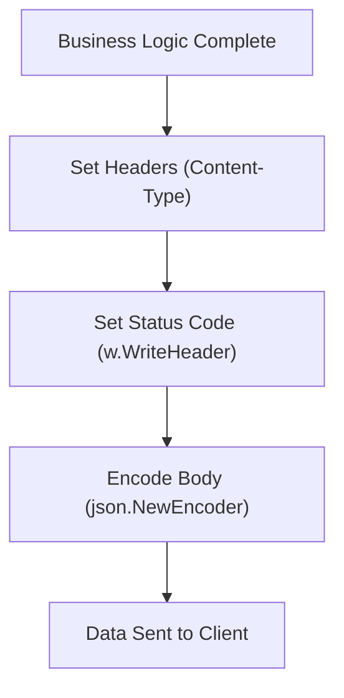

# HS.5 Response Writing Patterns

## Mission

Master the art of sending structured, professional responses from your Go server, ensuring that your clients receive correctly formatted data, headers, and status codes.

## Prerequisites

- `HS.4` request-parsing-and-validation

## Mental Model

Think of response writing as **Preparing a Package for Shipping**.

1. **The Item**: Your data (a struct).
2. **The Packing Slip (Headers)**: Before you close the box, you must attach the label that says what's inside (`Content-Type: application/json`).
3. **The Shipping Mode (Status Code)**: Is this a standard delivery (`200 OK`)? A redirected shipment (`302 Found`)? Or was the address wrong (`404 Not Found`)?
4. **The Crate (JSON Encoder)**: You put the item in a crate (`json.NewEncoder`) and ship it out.

## Visual Model



## Machine View

When you write to an `http.ResponseWriter`, you are actually writing to an underlying buffered network stream.
**Crucial Rule**: The moment you call `w.Write()` or `w.WriteHeader()`, the headers are sent. You **cannot** change headers after you have started writing the body. This is why you must always set your `Content-Type` first. Using `json.NewEncoder(w).Encode(data)` is the most efficient way to respond because it serializes your struct and writes it to the network buffer in a single pass, avoiding the creation of large intermediate strings in memory.

## Run Instructions

```bash
go run ./06-backend-db/01-web-and-database/http-servers/5-response-writing-patterns
```

Check the responses in your browser or terminal:
```bash
# Observe the JSON structure and Headers
curl -i http://localhost:8084/user
```

## Code Walkthrough

### Setting Headers
Use `w.Header().Set("Key", "Value")`. The most common header in modern APIs is `Content-Type: application/json`.

### `w.WriteHeader(int)`
Explicitly sets the HTTP status code. If you don't call this, Go defaults to `200 OK` as soon as you call `Write()`.

### `json.NewEncoder(w).Encode(v)`
Streams the JSON representation of `v` directly into the `ResponseWriter`. It's faster and more memory-efficient than `json.Marshal`.

### The `APIResponse` Wrapper
It is a best practice to wrap your data in a standard object. This allows you to add metadata (like messages or pagination info) without changing the shape of your domain models.

## Try It

1. Create a helper function `RespondWithJSON(w, code, data)` to automate the header setting and encoding process.
2. Add a `CreatedAt` timestamp to the `User` struct and see how it is formatted in the JSON output.
3. Try setting a header *after* calling `w.WriteHeader(http.StatusNotFound)` and see if it appears in the client response.

## In Production
Always handle encoding errors. While rare, `json.NewEncoder.Encode` can fail (e.g., if the data contains a circular reference). If it fails, your response might be partially written, which is difficult for clients to handle. For mission-critical responses, some engineers prefer `json.Marshal` first to ensure the JSON is valid before starting the HTTP write.

## Thinking Questions
1. Why must headers be set before status codes?
2. What is the benefit of the `omitempty` tag in the `APIResponse` struct?
3. How would you handle responding with different formats (JSON vs XML) based on the client's `Accept` header?

> **Forward Reference:** You can now send beautiful responses. But what happens when something goes wrong deep inside your code? You don't want to manually handle every possible error in every handler. In [Lesson 6: Error Handling Middleware](../6-error-handling-middleware/README.md), you will learn how to centralize your error logic for a cleaner, more robust server.

## Next Step

Next: `HS.6` -> `06-backend-db/01-web-and-database/http-servers/6-error-handling-middleware`

Open `06-backend-db/01-web-and-database/http-servers/6-error-handling-middleware/README.md` to continue.
