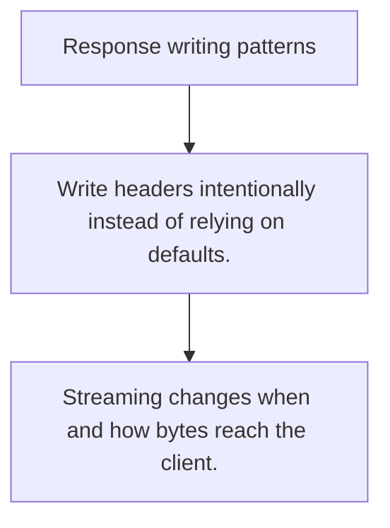

# HS.5 Response writing patterns

## Mission

Learn how status codes, headers, bodies, and streaming responses form one response contract.

## Prerequisites

- HS.4

## Mental Model

A response is a contract: status explains the outcome, headers explain metadata, and the body carries the payload.

## Visual Model



## Machine View

Once headers or body bytes are written, parts of the response contract are already committed to the client.

## Run Instructions

```bash
go run ./06-backend-db/01-web-and-database/http-servers/5-response-writing-patterns
```

## Code Walkthrough

### Write headers intentionally instead of relying on defa

Write headers intentionally instead of relying on defaults.

### Keep success and error payload shapes predictable.

Keep success and error payload shapes predictable.

### Streaming changes when and how bytes reach the client.

Streaming changes when and how bytes reach the client.

## Try It

1. Change one of the example inputs and rerun the lesson.
2. Explain which boundary the lesson is trying to make explicit.
3. Describe how you would apply HS.5 in a small service or tool.

## ⚠️ In Production

Response helpers reduce duplication and keep error cases consistent across the API.

## 🤔 Thinking Questions

1. What problem does this topic solve?
2. What breaks if this boundary is handled implicitly instead of explicitly?
3. Where would you expect to use this topic in production Go code?

## Next Step

Continue to `HS.6`.
