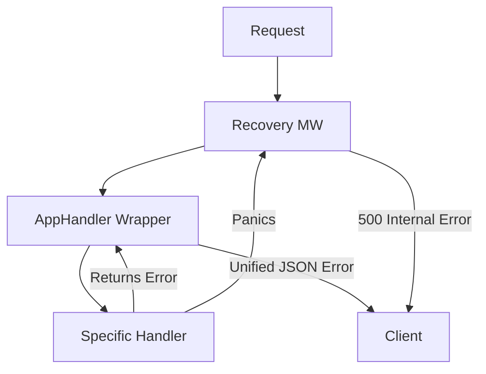

# HS.6 Error Handling Middleware

## Mission

Build a robust safety net for your server by centralizing error reporting and implementing recovery logic to gracefully handle unexpected panics.

## Prerequisites

- `HS.5` response-writing-patterns

## Mental Model

Think of error handling as a **Hospital Triage System**.

1. **The Patient**: The error returned by a handler.
2. **The Triage Nurse (AppHandler)**: Instead of every doctor (handler) trying to admit patients themselves, they all send patients to the Triage Nurse.
3. **Classification**: The nurse looks at the patient. Is it a "Known Condition" (`AppError`)? If so, apply the standard treatment (specific status code). Is it an "Unknown Emergency" (Internal Error)? If so, log the details and give a generic response to the family (the client) while alerting the team.
4. **The Emergency Brake (Recovery MW)**: If a doctor trips and falls (a Panic), the Recovery middleware is the net that catches them so the whole hospital doesn't have to close down.

## Visual Model



## Machine View

Go's standard `http.Handler` doesn't return anything, which often forces developers to call `http.Error` manually inside every function. By defining your own type like `type AppHandler func(...) error`, you can use Go's standard error handling within your logic. The `ServeHTTP` method on your `AppHandler` acts as a decorator. For panics, the `recover()` function must be called inside a `deferred` function within the goroutine that panicked. Since `net/http` starts a new goroutine for each request, a panic in one handler will normally crash the whole program if not caught by a recovery middleware.

## Run Instructions

```bash
go run ./06-backend-db/01-web-and-database/http-servers/6-error-handling-middleware
```

Test the error and panic recovery:
```bash
# Test a handled error
curl -i http://localhost:8085/fail

# Test a panic (and see the server stay alive!)
curl -i http://localhost:8085/panic
```

## Code Walkthrough

### The `AppHandler` Pattern
This is a powerful idiom. By implementing `ServeHTTP` on a function type, we can perform "post-processing" on the returned error. This is the perfect place to log errors to an external system (like Sentry or Datadog) or to ensure all errors follow a consistent JSON format.

### `errors.As`
We use `errors.As` to check if a returned error is a specific `AppError` type. This allows our handlers to return detailed error info while the middleware stays generic.

### The `Recovery` Middleware
The most important middleware in any production server. It uses `defer` and `recover()` to catch panics. Without this, a single nil-pointer dereference in one handler would crash your entire API for all users.

### Logging
Notice how we log the **real** error message to the server console, but send a **sanitized** message to the client. Never leak internal database errors or stack traces to the public!

## Try It

1. Modify `AppError` to include an "Error Code" string (e.g., `ERR_AUTH_FAILED`) and include it in the response.
2. Update the `Recovery` middleware to print the stack trace using `runtime/debug`.
3. Create a handler that returns a standard `errors.New("generic")` and see how the middleware handles it as a 500 error.

## In Production
While `recover()` saves your server from crashing, a panic is still a sign of a bug. Your recovery middleware should always log the incident with high priority so developers can fix the underlying issue. Also, consider using a structured logger (like `slog`) instead of the standard `log` package for better observability.

## Thinking Questions
1. Why do we log more information to the console than we send to the client?
2. What are the risks of using `recover()` to "hide" bugs instead of fixing them?
3. How would you modify the `AppHandler` to handle different response types (e.g., XML vs JSON errors)?

> [!TIP]
> Your server is now stable and handles errors like a pro. But in the real world, requests can hang forever. In [Lesson 7: Server Timeouts](../7-server-timeouts/README.md), you will learn how to protect your server's resources from slow clients and hanging dependencies.

## Next Step

Next: `HS.7` -> [`06-backend-db/01-web-and-database/http-servers/7-server-timeouts`](../7-server-timeouts/README.md)
