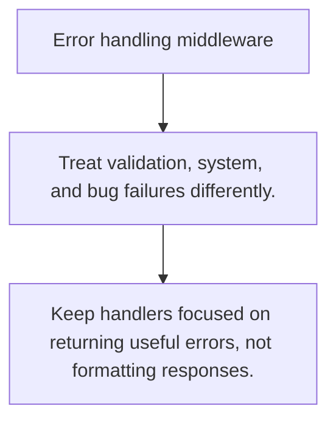

# HS.6 Error handling middleware

## Mission

Learn how central error translation keeps handlers thin and HTTP behavior consistent.

## Prerequisites

- HS.5

## Mental Model

Handlers produce domain errors; middleware maps those errors into status codes and response bodies.

## Visual Model



## Machine View

Centralized translation keeps transport policy in one place instead of duplicating it across handlers.

## Run Instructions

```bash
go run ./06-backend-db/01-web-and-database/http-servers/6-error-handling-middleware
```

## Code Walkthrough

### Treat validation, system, and bug failures differently

Treat validation, system, and bug failures differently.

### Translate domain errors at the HTTP boundary.

Translate domain errors at the HTTP boundary.

### Keep handlers focused on returning useful errors, not 

Keep handlers focused on returning useful errors, not formatting responses.

## Try It

1. Change one of the example inputs and rerun the lesson.
2. Explain which boundary the lesson is trying to make explicit.
3. Describe how you would apply HS.6 in a small service or tool.

## ⚠️ In Production

HTTP APIs become easier to audit when one layer decides how user, system, and bug errors are rendered.

## 🤔 Thinking Questions

1. What problem does this topic solve?
2. What breaks if this boundary is handled implicitly instead of explicitly?
3. Where would you expect to use this topic in production Go code?

## Next Step

Continue to `HS.7`.
