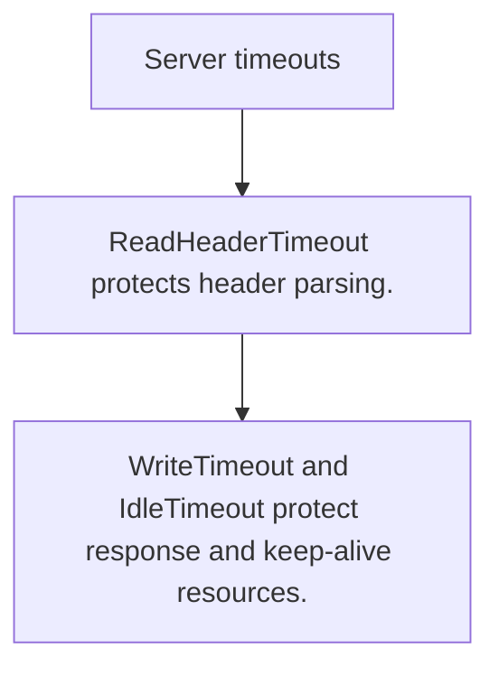

# HS.7 Server timeouts

## Mission

Learn why HTTP servers need read, header, write, and idle timeouts to stay safe under pressure.

## Prerequisites

- HS.6

## Mental Model

Timeouts are resource guards. They stop one slow or malicious client from holding the server forever.

## Visual Model



## Machine View

Different timeout fields protect different stages of the request lifecycle: header read, body read, response write, and idle keep-alive.

## Run Instructions

```bash
go run ./06-backend-db/01-web-and-database/http-servers/7-server-timeouts
```

## Code Walkthrough

### ReadHeaderTimeout protects header parsing.

ReadHeaderTimeout protects header parsing.

### ReadTimeout limits the full body-read window.

ReadTimeout limits the full body-read window.

### WriteTimeout and IdleTimeout protect response and keep

WriteTimeout and IdleTimeout protect response and keep-alive resources.

## Try It

1. Change one of the example inputs and rerun the lesson.
2. Explain which boundary the lesson is trying to make explicit.
3. Describe how you would apply HS.7 in a small service or tool.

## ⚠️ In Production

Missing timeout settings creates real attack surfaces, especially slowloris-style header drips and slow response consumers.

## 🤔 Thinking Questions

1. What problem does this topic solve?
2. What breaks if this boundary is handled implicitly instead of explicitly?
3. Where would you expect to use this topic in production Go code?

## Next Step

Continue to `HS.8`.
