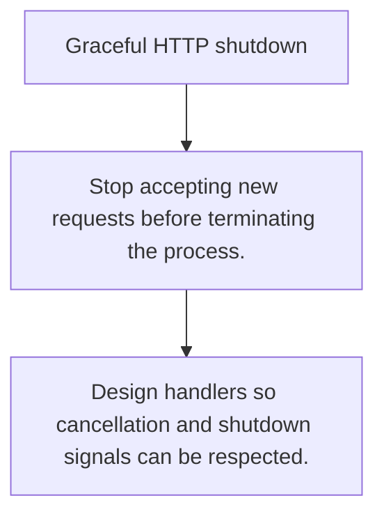

# HS.8 Graceful HTTP shutdown

## Mission

Learn how to stop accepting new work while allowing in-flight requests to finish cleanly.

## Prerequisites

- HS.7

## Mental Model

Graceful shutdown is a drain: stop the front door, wait for active requests, then release the process.

## Visual Model



## Machine View

HTTP shutdown coordinates listeners, keep-alive state, request contexts, and deadlines so in-flight work can finish or time out.

## Run Instructions

```bash
go run ./06-backend-db/01-web-and-database/http-servers/8-graceful-http-shutdown
```

## Code Walkthrough

### Stop accepting new requests before terminating the pro

Stop accepting new requests before terminating the process.

### Use contexts and deadlines to bound the drain window.

Use contexts and deadlines to bound the drain window.

### Design handlers so cancellation and shutdown signals c

Design handlers so cancellation and shutdown signals can be respected.

## Try It

1. Change one of the example inputs and rerun the lesson.
2. Explain which boundary the lesson is trying to make explicit.
3. Describe how you would apply HS.8 in a small service or tool.

## ⚠️ In Production

Rolling deploys, autoscaling, and restarts all depend on shutdown behavior that does not drop useful work unnecessarily.

## 🤔 Thinking Questions

1. What problem does this topic solve?
2. What breaks if this boundary is handled implicitly instead of explicitly?
3. Where would you expect to use this topic in production Go code?

## Next Step

Continue to `HS.9`.
