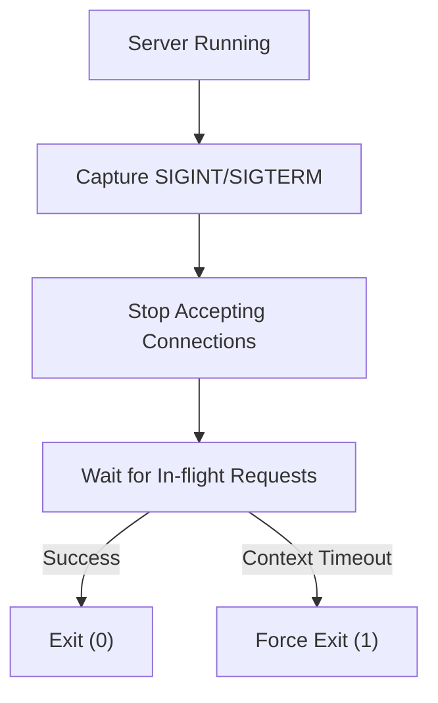

# HS.8 Graceful HTTP Shutdown

## Mission

Learn how to implement a professional shutdown sequence that captures OS signals and allows active requests to finish before the program exits.

## Prerequisites

- `HS.7` server-timeouts

## Mental Model

Think of graceful shutdown as **Closing a Restaurant at Night**.

1. **The Signal**: The "Closed" sign is turned on (The server receives `SIGTERM`).
2. **The Door**: No new customers are allowed to enter (The server stops accepting new TCP connections).
3. **The Diners**: The people already inside the restaurant are allowed to finish their meals (In-flight requests are given time to complete).
4. **The Cleanup**: Once the last diner leaves, the staff cleans up and locks the back door (The program finally exits).
5. **The Deadline**: If a diner refuses to leave after an hour, the security team (the context timeout) eventually asks them to move so the building can be locked.

## Visual Model



## Machine View

When a process is killed (e.g., via `Ctrl+C` or a Kubernetes deployment), the OS sends a signal. `SIGINT` (Interrupt) is usually sent by the user, while `SIGTERM` (Terminate) is sent by orchestration tools. In Go, we use `os/signal` to intercept these signals. The `server.Shutdown()` method is specifically designed to stop the HTTP listener while keeping the active request goroutines running. It waits until all active requests have returned before resolving. By using `context.WithTimeout`, we ensure that our program doesn't hang forever if a request is stuck, giving us a "Hard Deadline" for the shutdown.

## Run Instructions

```bash
go run ./06-backend-db/01-web-and-database/http-servers/8-graceful-http-shutdown
```

**To test the graceful behavior:**
1. Run the command above.
2. In another terminal or browser, visit `http://localhost:8087/work`.
3. Immediately go back to the first terminal and press `Ctrl+C`.
4. Observe that the server doesn't quit immediately; it waits until the `/work` request is finished (5 seconds) and then exits.

## Code Walkthrough

### `signal.Notify`
This function registers a channel to receive specific OS signals. We use a buffered channel (`chan os.Signal, 1`) to ensure the signal is caught even if the main thread is busy.

### Goroutine `ListenAndServe`
Because `ListenAndServe` is a blocking call, we must run it in its own goroutine. This allows the main thread to remain free to wait for the shutdown signal.

### `server.Shutdown(ctx)`
The star of the show. It handles the complex logic of closing listeners and tracking active connections. Note that it returns `http.ErrServerClosed` immediately to the `ListenAndServe` goroutine, so you should handle that error gracefully.

### `context.WithTimeout`
This provides the "Max Wait Time". If your server doesn't shut down within this limit (e.g., 10 seconds), the `Shutdown` method will return an error, allowing you to force the exit.

## Try It

1. Change the timeout to be shorter than the "Work" duration (e.g., 2 seconds) and observe the server forcing a shutdown.
2. Add logic to close a database connection or clear a cache after `server.Shutdown` but before the program exits.
3. Test how the server responds to `SIGTERM` using `kill <PID>` instead of `Ctrl+C`.

## In Production
Graceful shutdown is mandatory for **Zero-Downtime Deployments**. In a environment like Kubernetes, the orchestrator sends a `SIGTERM`, waits a certain amount of time (the "terminationGracePeriod"), and then sends a `SIGKILL`. If your server doesn't handle the `SIGTERM` gracefully, users will see "Connection Refused" errors during every update.

## Thinking Questions
1. Why is the signal channel buffered?
2. What happens to new requests that arrive *after* `Shutdown` has been called but before the process exits?
3. How does graceful shutdown help prevent data corruption in systems that write to a database?

> **Forward Reference:** You've built a professional server that knows how to start and stop correctly. But how do external systems (like Load Balancers) know if your server is healthy? In [Lesson 9: Health and Readiness Probes](../9-health-and-readiness-probes/README.md), you will learn how to expose your server's internal state to the world.

## Next Step

Continue to `HS.9` health-and-readiness-probes.
