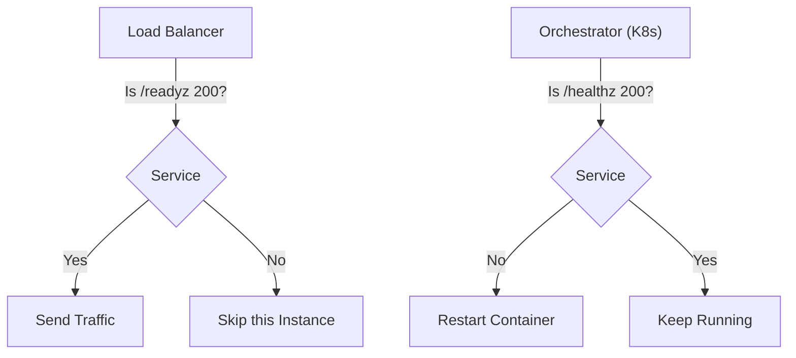

# HS.9 Health and Readiness Probes

## Mission

Learn how to expose your server's internal state to orchestrators and load balancers using standardized health and readiness endpoints.

## Prerequisites

- `HS.8` graceful-http-shutdown

## Mental Model

Think of probes as **Standardized Medical Checks for a Worker**.

1. **Liveness Check (`/healthz`)**: Is the worker conscious? If not, they need to be replaced (The container is restarted).
2. **Readiness Check (`/readyz`)**: Is the worker actually able to do their job right now? Maybe they are alive but currently busy on the phone or waiting for a tool (The database is down). If they aren't ready, we don't give them new tasks (The load balancer stops sending requests).
3. **Startup Check**: Has the worker finished their morning coffee and training? (The cache is still warming up).

## Visual Model



## Machine View

Health probes are usually called every few seconds by an external system. They should be extremely fast and lightweight.
- **Liveness** should almost always return `200 OK` immediately. It only fails if the process is deadlocked or in a non-recoverable state.
- **Readiness** should perform a "shallow" check of its environment. It might ping the database with a `SELECT 1` or check if a local cache is populated. If any critical dependency is missing, it returns a `503 Service Unavailable`.
- Using `atomic.Bool` or `atomic.Value` to store the readiness state ensures that concurrent probe requests always see the most up-to-date and thread-safe status.

## Run Instructions

```bash
go run ./06-backend-db/01-web-and-database/http-servers/9-health-and-readiness-probes
```

Observe the transition from "Not Ready" to "Ready":
1. Start the server.
2. Immediately run: `curl -i http://localhost:8088/readyz` (You'll get a 503).
3. Wait 5 seconds for the "startup" to finish.
4. Run: `curl -i http://localhost:8088/readyz` again (You'll get a 200).

## Code Walkthrough

### `/healthz` vs `/readyz`
These are the industry standard names for these endpoints. The `z` suffix is a convention used to avoid collisions with actual business routes (like `/health`).

### Atomic State
We use `atomic.Bool` for the `isReady` flag because the startup routine and the HTTP handlers are running in different goroutines. Atomic operations are faster and cleaner than Mutexes for simple boolean flags.

### Simulation of Startup
In a real app, the `isReady` flag would be set to `true` only after successful database connection, migration, and cache warming.

### Status Codes
- `200 OK`: All systems go.
- `503 Service Unavailable`: The server is alive but cannot handle requests right now.

## Try It

1. Implement a database "Ping" in the readiness probe using a mock function that randomly fails.
2. Add a `/version` endpoint that returns the current build version of the application-useful for ensuring deployments happened correctly.
3. Combine the health probe with a `sync.Mutex` to protect a complex status object that includes multiple sub-system checks.

## In Production
**Do not do heavy work in probes.** If your readiness probe takes 10 seconds to run, the load balancer might time out and think you are down. Keep your checks "shallow." For example, instead of running a complex query, just check if the database connection pool is not exhausted. Also, ensure your probes are not protected by authentication-the load balancer needs to reach them easily!

## Thinking Questions
1. Why shouldn't the liveness probe check the database? (Hint: What happens if the DB goes down and K8s restarts 1,000 containers at once?)
2. What is the benefit of using the `503` status code specifically?
3. How would you implement a "Deep" health check for a human operator to see detailed system status?

> **Forward Reference:** You have learned all the pieces of a professional Go HTTP server: routing, middleware, parsing, responding, error handling, timeouts, shutdown, and health checks. It's time to put it all together. In [Lesson 10: REST API Exercise](../10-rest-api-exercise/README.md), you will build a complete, production-ready API from scratch.

## Next Step

Next: `HS.10` -> `06-backend-db/01-web-and-database/http-servers/10-rest-api-exercise`

Open `06-backend-db/01-web-and-database/http-servers/10-rest-api-exercise/README.md` to continue.
