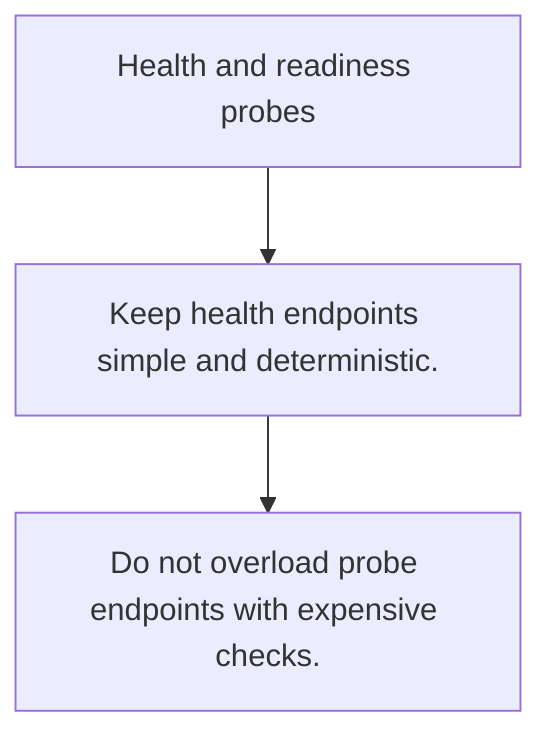

# HS.9 Health and readiness probes

## Mission

Learn why liveness and readiness are different signals and why each needs a clear contract.

## Prerequisites

- HS.8

## Mental Model

Health says the process is alive. Readiness says the service can handle real traffic right now.

## Visual Model



## Machine View

Probe endpoints are tiny APIs for your scheduler, load balancer, and operators.

## Run Instructions

```bash
go run ./06-backend-db/01-web-and-database/http-servers/9-health-and-readiness-probes
```

## Code Walkthrough

### Keep health endpoints simple and deterministic.

Keep health endpoints simple and deterministic.

### Readiness should reflect dependencies required for saf

Readiness should reflect dependencies required for safe traffic.

### Do not overload probe endpoints with expensive checks.

Do not overload probe endpoints with expensive checks.

## Try It

1. Change one of the example inputs and rerun the lesson.
2. Explain which boundary the lesson is trying to make explicit.
3. Describe how you would apply HS.9 in a small service or tool.

## ⚠️ In Production

A misleading readiness check can black-hole traffic or mask a degraded dependency long enough to cause a larger incident.

## 🤔 Thinking Questions

1. What problem does this topic solve?
2. What breaks if this boundary is handled implicitly instead of explicitly?
3. Where would you expect to use this topic in production Go code?

## Next Step

Continue to `HS.10`.
