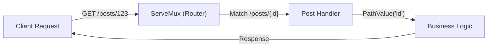

# MC.1 Web Masterclass - Routing

## Mission

Master the foundational skills of Go web development by learning how to use the modern `net/http` router to handle requests, extract URL parameters, and build a clean API structure.

## Prerequisites

- `DM.1` embedded-migrations

## Mental Model

Think of a Router as **The Receptionist in a Large Office Building**.

1. **The Entrance**: Every person (The Request) comes in through the same front door (The HTTP Server).
2. **The Inquiry**: The person tells the receptionist where they want to go: "I'm looking for the Legal department" (`GET /legal`) or "I have a package for ID 42" (`GET /packages/42`).
3. **The Direction**: The receptionist looks at their internal directory (The ServeMux) and tells the person exactly which room to go to (The Handler).
4. **The Specialized Skill**: If someone brings a package, the receptionist knows to send them to the mailroom (The POST handler), whereas someone asking for information is sent to the information desk (The GET handler).

## Visual Model



## Machine View

In Go 1.22+, `http.ServeMux` uses an advanced pattern-matching algorithm.
- **Precedence**: Longer, more specific patterns take precedence over shorter ones. For example, `/posts/featured` will match before `/posts/{id}`.
- **Path Parameter Slicing**: When you use `{id}`, Go doesn't just "split" the string. It identifies the offsets in the URL path and provides them to you via `r.PathValue()`, which is much faster than manual string parsing.
- **Method Enforcement**: If you define a route as `GET /about`, any `POST` request to that same URL will automatically receive a `405 Method Not Allowed` response without you writing a single line of extra code.

## Run Instructions

```bash
go run ./06-backend-db/01-web-and-database/web-masterclass/1-routing
```

Visit the routes mentioned in the console output in your browser or using `curl`.

## Code Walkthrough

### `http.NewServeMux()`
Creates a fresh router. It is a good practice to create a local mux rather than using the `http.DefaultServeMux` (which is a global variable that can lead to bugs in large projects).

### `mux.HandleFunc("GET /path", handler)`
The modern way to register routes. The method and path are combined into a single string. Note the space between `GET` and `/`.

### `r.PathValue("id")`
The native way to retrieve wildcard parameters. It returns the value as a string. You are responsible for converting it to an `int` if needed.

### `http.StripPrefix`
Used when serving static files. It tells Go: "If someone asks for `/static/style.css`, look for a file named `style.css` in the local directory, removing the `/static/` part from the search path."

## Try It

1. Add a new route `GET /hello/{name}` and make it print "Hello, [name]!".
2. Try to visit `/about` using a `POST` request (use `curl -X POST`). What happens?
3. Add a "Catch-all" route at the end that returns a custom 404 page.

## In Production
While `net/http` is now very powerful, some teams still prefer third-party routers like **chi** or **gin** for their advanced features (like automatic OpenAPI documentation or built-in validation). However, for 90% of use cases, the standard library is now the fastest and most reliable choice.

## Thinking Questions
1. Why was method-based routing such a big addition to the Go standard library?
2. What is the difference between `mux.Handle` and `mux.HandleFunc`?
3. How would you handle a route that has multiple parameters, like `/users/{userID}/posts/{postID}`?

> **Forward Reference:** You have the entry point. But as your handlers grow, they will need access to databases, loggers, and configuration. In [Lesson 2: Dependency Injection](../2-dependency-injection/README.md), you will learn how to pass these resources to your handlers without using messy global variables.

## Next Step

Continue to `MC.2` dependency-injection.
