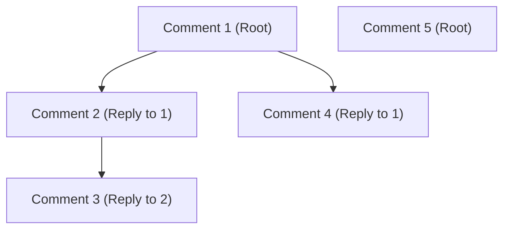

# MC.10 Comments & Nesting

## Mission

Learn how to handle hierarchical data relationships in Go, transform flat database results into a nested tree structure, and build complex threaded comment systems.

## Prerequisites

- `MC.9` pagination

## Mental Model

Think of Nested Comments as **A Family Tree**.

1. **The Individual (The Comment)**: Every person has a name and some details.
2. **The Connection (The ParentID)**: Every person (except the original ancestor) has exactly one biological parent.
3. **The Family (The Thread)**: Even though everyone is an individual, they are organized into a tree structure of parents, children, and grandchildren.
4. **The View**: When you look at the family tree, you don't just see a list of people; you see the branches and connections between them.

## Visual Model



## Machine View

In a relational database (SQL), we use the **Adjacency List** pattern.
- **The Schema**: We add a `parent_id` column to our `comments` table. If the value is `NULL`, it's a top-level comment.
- **The Retrieval**: We fetch all comments for a post in a single query: `SELECT * FROM comments WHERE post_id = 1`. This returns a **Flat List**.
- **The Transformation**: In Go, we use a **Two-Pass Algorithm** to turn this flat list into a tree.
    1. Pass 1: Put every comment into a `map[int]*Comment`.
    2. Pass 2: Loop through the comments. If a comment has a `ParentID`, look up the parent in the map and append the current comment to the parent's `Replies` slice.

## Run Instructions

```bash
go run ./06-backend-db/01-web-and-database/web-masterclass/10-comments
```

Visit `http://localhost:8089/api/comments` to see the hierarchical JSON output.

## Code Walkthrough

### The `Comment` Struct
Note the `Replies []*Comment` field. This is a "Recursive" structure. It allows a comment to contain other comments, which can contain even more comments, and so on.

### The Two-Pass Algorithm
This is the most efficient way to build a tree in memory. It is O(N) because we only visit each comment twice. It avoids the overhead and potential memory issues of deep recursion.

### Pointers in the Map
We store **Pointers** (`*Comment`) in our map. This is critical because when we append a child to a parent's `Replies` slice, we want that change to be reflected everywhere that parent is referenced.

### JSON Omission
We use `json:",omitempty"` on the `Replies` field so that if a comment has no replies, the JSON doesn't include an empty `[]` array, keeping the response clean.

## Try It

1. Add a new comment to the simulated list that is a reply to Charlie (ID 3) and see how the tree grows deeper.
2. What happens if you accidentally create a "Circular Reference" (e.g., Comment 1 is the parent of Comment 2, and Comment 2 is the parent of Comment 1)? Try it and see if your code (or the JSON encoder) crashes.
3. Implement a "Flatten" function that takes a tree and turns it back into a sorted list for a different view.

## In Production
**Limit the depth of nesting.**
Deeply nested trees can be difficult for users to read on mobile devices and can lead to performance issues when rendering. Many production systems (like Reddit or YouTube) limit the depth of nesting to 5-10 levels, after which they simply show a "View more replies" link.

## Thinking Questions
1. Why is it better to build the tree in the backend rather than letting the frontend do it?
2. What is the alternative to the Adjacency List pattern? (Hint: Look up "Path Enumeration" or "Nested Sets").
3. How would you handle deleting a comment that has 50 replies?

> **Forward Reference:** You can handle complex data relationships. Now let's move from static responses to real-time communication! In [Lesson 11: WebSockets](../11-websockets/README.md), you will learn how to build interactive, live features like chat and notifications.

## Next Step

Continue to `MC.11` websockets.
