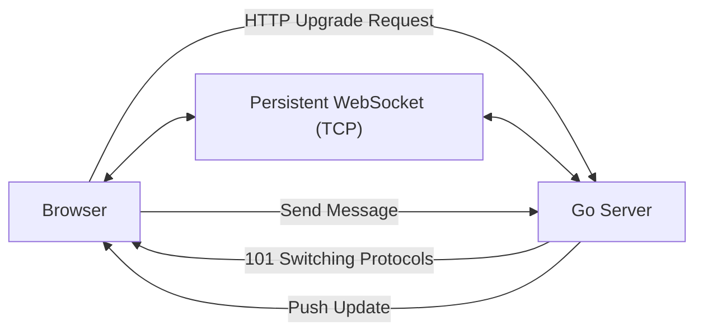

# MC.11 WebSockets

## Mission

Break free from the request-response cycle and learn how to implement real-time, bidirectional communication between your Go server and a web browser using WebSockets.

## Prerequisites

- `MC.10` comments

## Mental Model

Think of a WebSocket as **An Open Phone Line**.

1. **The Handshake (HTTP Upgrade)**: You call someone. When they answer, you say, "Actually, let's switch to our private walkie-talkies so we can both talk at the same time without hanging up."
2. **The Connection (The Socket)**: Once you both switch, the line stays open. Neither of you has to "redial" to send a message.
3. **The Duplex Communication**: You can shout "Hello!" while they are shouting "Goodbye!". Information flows in both directions simultaneously.
4. **The Hangup (Disconnect)**: The line stays open until one of you decides to put the walkie-talkie down.

## Visual Model



## Machine View

- **The Upgrade**: A WebSocket connection starts as a normal HTTP request. The client sends a special header: `Upgrade: websocket`. If the server agrees, it returns an `HTTP 101` status code and "hijacks" the underlying TCP connection.
- **Frames vs. Packets**: WebSockets send data in "Frames." These are small wrappers around your data that specify if it's Text, Binary, or a Control frame (like a Ping/Pong to check if the connection is still alive).
- **Goroutine per Connection**: In Go, we typically use one goroutine to read from the socket and another to write to it. This allows for truly concurrent bidirectional communication.

## Run Instructions

```bash
go run ./06-backend-db/01-web-and-database/web-masterclass/11-websockets
```

Open `http://localhost:8090` in your browser. Type a message and watch the server echo it back instantly without refreshing the page!

## Code Walkthrough

### `websocket.Upgrader`
This struct handles the heavy lifting of switching from HTTP to the WebSocket protocol. We configure things like buffer sizes and which domains are allowed to connect (`CheckOrigin`).

### `conn.ReadMessage()`
This function blocks until a message is received from the client. It returns the message type (Text or Binary) and the data as a byte slice.

### `conn.WriteMessage()`
Sends data back to the client. Like reading, it requires a message type.

### The `for` Loop (The Message Pump)
Because a WebSocket is persistent, we use an infinite loop to keep the handler alive. If `ReadMessage` returns an error (e.g., the user closed their browser), we `break` out of the loop and the connection is closed.

## Try It

1. Open two different browser tabs to the same URL. Notice how each one has its own independent connection to the server.
2. Implement a simple "Broadcast" system where a message sent from one tab is shown in all other open tabs. (Hint: You'll need a global slice to store active `*websocket.Conn` objects and a `sync.Mutex` to protect it).
3. Send a JSON object instead of a plain string and use `json.Unmarshal` on the server to parse it.

## In Production
**Handle disconnects gracefully.**
Users on mobile devices will constantly lose their internet connection. Your server must be able to detect "Zombie" connections that are still open but inactive, and your client-side code must be able to automatically reconnect when the internet returns.

## Thinking Questions
1. Why are WebSockets more efficient than "Polling" (asking the server for updates every 5 seconds)?
2. What happens to a WebSocket connection if your server restarts?
3. When would you use WebSockets instead of a standard REST API?

> **Forward Reference:** You have mastered the web! You can build servers, APIs, databases, and real-time systems. Now it's time to dive into the engine that makes Go so powerful. In [Section 07: Concurrency](../../../../07-concurrency/README.md), you will learn how to master Goroutines, Channels, and the secrets of high-performance parallel programming.

## Next Step

Continue to `GC.0` concurrency-masterclass.
