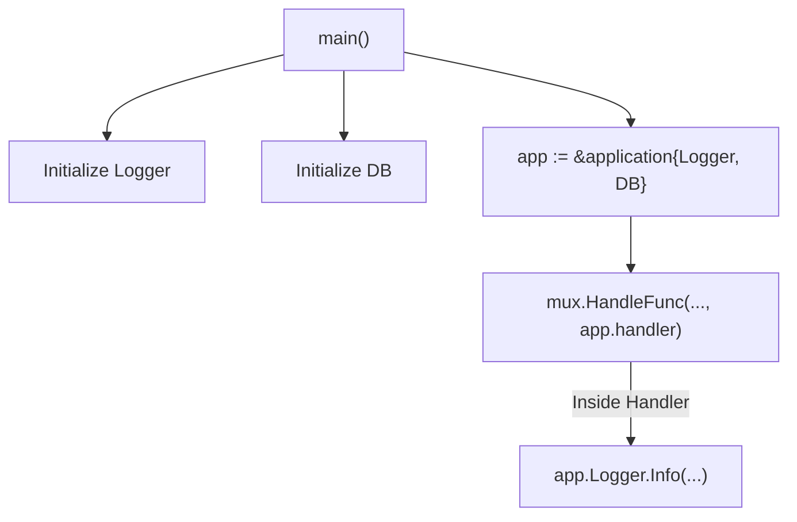

# MC.2 Dependency Injection

## Mission

Learn the professional Go pattern for sharing resources (like loggers, database pools, and configuration) across your HTTP handlers without using messy and dangerous global variables.

## Prerequisites

- `MC.1` routing

## Mental Model

Think of Dependency Injection as **Equipping a Specialized Tool Belt**.

1. **The Tool Belt (The Application Struct)**: Every worker (The Handler) needs a set of tools to do their job (Logger, Database, Config).
2. **The Equipping (The Constructor)**: Before the worker starts their shift, you hand them a belt already loaded with the exact tools they need.
3. **The Work (The Method)**: The worker doesn't have to go looking for a hammer in a giant communal bin (The Global Scope). The hammer is right there on their belt (`app.logger`), ready to use.
4. **The Swap**: If you want to test the worker's performance, you can give them a plastic toy hammer (A Mock) instead of a real one, and the worker doesn't even have to change their technique.

## Visual Model



## Machine View

In Go, Dependency Injection is remarkably simple because functions can be **Methods** on structs.
- **Pointer Semantics**: We typically use a pointer to our application struct (`*application`). This ensures that every handler is looking at the *same* instance of the logger or database pool, rather than a copy.
- **Type Safety**: Because the dependencies are fields on a struct, the compiler guarantees that they exist and are of the correct type. If you forget to initialize a field, you'll likely get a nil-pointer panic, which is much easier to debug than a silent global variable bug.
- **No Reflection**: Unlike Java or .NET, Go DI is "Explicit." You can follow the code from `main()` directly into the handler to see exactly where every object came from.

## Run Instructions

```bash
go run ./06-backend-db/01-web-and-database/web-masterclass/2-dependency-injection
```

Check your terminal output to see the logger in action when you visit the home page.

## Code Walkthrough

### The `application` Struct
This is your "Service Container." It holds any resource that needs to be shared. In a real-world app, this would include things like `*sql.DB`, `*redis.Client`, and `*smtp.Client`.

### Methods as Handlers
By defining our handlers as `func (app *application) name(...)`, we give them access to the `app` variable (the receiver). This is how the "Injection" actually happens.

### `slog` (Structured Logging)
The example uses Go's built-in `log/slog` package. It allows you to log data in a machine-readable format (like JSON or Key-Value pairs), which is essential for production monitoring and debugging.

## Try It

1. Add a `config` struct as a field inside the `application` struct and use it to store the server's port number.
2. Add a new handler `handleVersion` that prints a hardcoded version string from the `application` struct.
3. Try to use the logger inside `handleHealth` to log whenever someone checks the system status.

## In Production
**Avoid "God Objects."** While it's tempting to put every single utility into your `application` struct, keep it focused on high-level dependencies. If the struct grows too large, consider splitting it into smaller, more focused service structs (e.g., `AuthService`, `EmailService`).

## Thinking Questions
1. Why are global variables considered "dangerous" in a multi-threaded web server?
2. How does this pattern make it easier to write unit tests for a single handler?
3. What happens if you forget to initialize a field in the `application` struct before the server starts?

> **Forward Reference:** You have the logic and the tools. Now you need a way to present data to your users. In [Lesson 3: HTML Templates](../3-templates/README.md), you will learn how to use Go's powerful `html/template` package to generate dynamic web pages.

## Next Step

Continue to `MC.3` templates.
